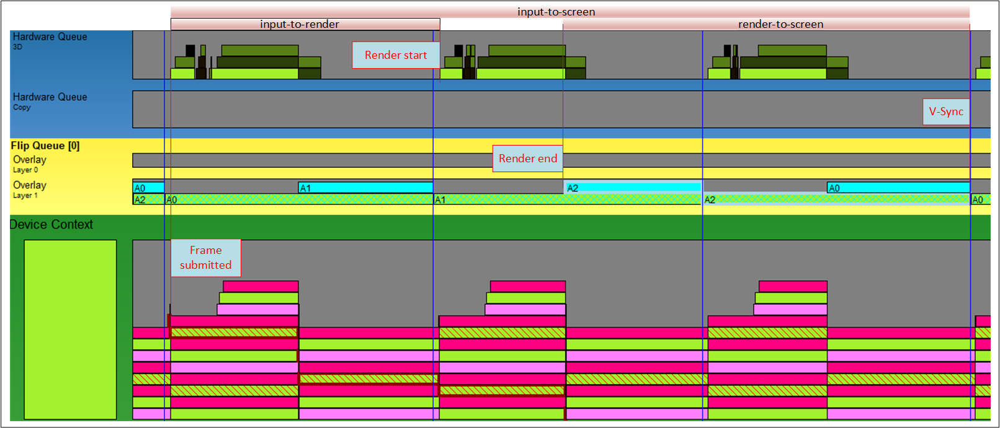
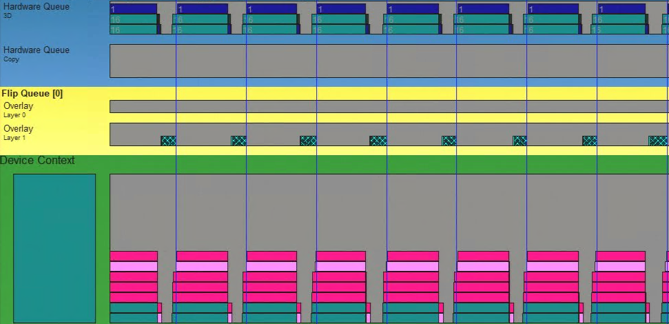
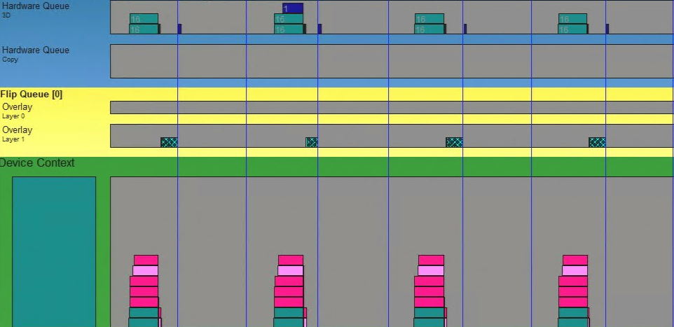
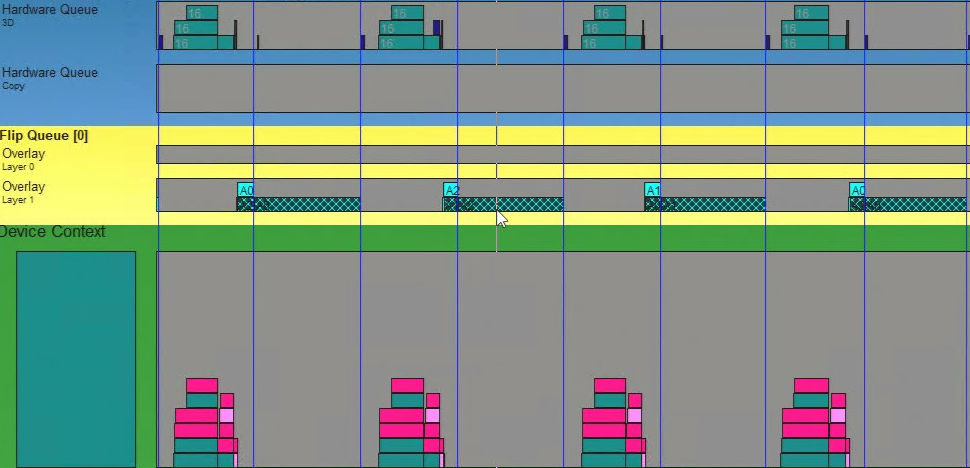

# Intel® Xe Low Latency (XeLL) Developer Guide 1.2

Intel® Xe Low Latency (XeLL) enables latency reduction in applications to enhance user experience
and utilize the GPU in the most optimal way.

Table of Contents

- [Introduction](#introduction)
  - [Behavior](#behavior)
- [Requirements](#requirements)
- [Integration Considerations](#integration-considerations)
- [Integration Checklist](#integration-checklist)
- [Features](#features)
  - [Low Latency](#low-latency)
  - [Frame Limiter](#frame-limiter)
- [Cross-vendor support](#cross-vendor-support)
  - [XeSS-FG Support](#xess-fg-support)
- [Deployment](#deployment)
- [Naming Conventions and Branding Guidance](#naming-conventions-and-branding-guidance)
- [Programming Guide](#programming-guide)
  - [Initialization](#initialization)
    - [Logging Callback](#logging-callback)
  - [Enable Features](#enable-features)
  - [Sleep](#sleep)
  - [Markers](#markers)
    - [Simulation](#simulation)
    - [RenderSubmit](#rendersubmit)
    - [Present](#present)
  - [Shutdown](#shutdown)
  - [Versioning](#versioning)
- [Notices](#notices)

## Introduction

An application's latency depends on multiple factors, such as its design and performance, monitor's
specification (variable or constant refresh rate), and software settings (e.g., VSync). This document
focuses on three types of latency metrics, which are visible in Figure 1. The period between a frame
being submitted to a GPU and rendering start is what we call input-to-render latency. The time that a
rendered frame was waiting after render has completed until it was presented on a screen (arrives at
a blue vertical line) is called render-to-screen latency. Together with rendering time, they create a
combined input-to-screen latency.

 *Figure 1. Latency types visible in GpuView.*

The input-to-render metric describes the delay between GPU work submission and actual rendering
start. Every new submission will be added to a render software queue before it reaches the GPU
hardware queue. In the ideal scenario, GPU work submission should start around the time when the previous
frame finishes its execution, while input sampling should be as close to this moment as possible.
Input sampling done earlier adds latency to the application, causing user experience
degradation due to an “input lag” feeling.

The render-to-screen metric describes the delay between the finish of GPU rendering and actual
presentation on the screen. Optimizing this latency is important when the application runs with "no
tearing" mode, where the present request waits for the next VSync interval to be displayed on a screen.
In the ideal scenario, GPU rendering should finish as close to this moment as possible. Having a
frame ready earlier adds to increased latency.

XeLL, when integrated into the application, receives per-frame timing information that allows the
library to calculate the CPU delay that an application should apply before work on the next frame
begins. By doing so, the time from when the application begins work on a CPU to presentation on a
screen is minimized, that is, input-to-screen latency is decreased, allowing for the best user
experience. The additional delay is calculated so that latency is minimized, while the application's
performance is preserved.

### Behavior

The `xellSleep` function performs a CPU-side wait before the frame begins and implements two kinds
of latency optimizations.

The first is render queue reduction, which is always available. This optimization instructs the
application to wait before CPU work for the next frame begins until the last possible moment, so that
when command lists pertaining to the next frame are submitted to a GPU, it will not be queued, but
its GPU processing will start almost immediately. This results in a decrease in input-to-render
latency.

The second mode of latency reduction makes sure that the moment when a frame is ready for
presentation is aligned with VSync intervals of a monitor while preserving minimal latency. This
mode is only active when the application's performance is sufficient and applies when DXGI Present
has the sync interval set to 1.

## Requirements

- Windows 10/11 x64 - 10.0.19043/22000 or later,
- DirectX12,
- Monitor connected directly to the rendering GPU,
- DXGI flip model used.

Supported devices:

- Intel® Arc™ A-Series or later,
- any non-Intel GPU supporting XeSS-FG.

Any other forms of latency reduction or wait inducing technologies like frame limiters should be
disabled when XeLL is in use. If the requirement is not satisfied, then timings gathered by XeLL may
become inaccurate and might result in undefined behavior.

Passing frame limit to XeLL allows it to enable certain optimizations which would be not available
in case of a separate frame limiter. If an application implements its own frame limiter the wait
operation should happen before `xellSleep` gets called. Having both, application frame limiter and
XeLL active at the same time is discouraged.

When it comes to scheduling the work, application should not implement any additional submission
logic, like waiting for previous frame to finish. With XeLL enabled, work submission will be
controlled by `xellSleep`, as it will ensure that each frame starts submitting at the right time to
utilize the GPU in the optimal way and create best user experience by reducing the latency.

Applications should allow VSync when XeLL is enabled, but only allow to use sync interval set to `1`
in DXGI Present call.

## Integration Considerations

It is recommended that an application calls the XeLL API each frame even if all the features are
currently disabled. XeLL ensures that minimal work is done in the system when running in
pass-through mode. Features should be controlled only via `xellSetSleepMode`. Such approach should
simplify the integration and minimize work that needs to be done during settings change.

In the future, integration might bring additional benefits to the user using Arc Software and driver
cooperation. In other words, it is recommended for the application's behavior to be the same with
XeLL active or inactive. The only difference would be the state provided in `xellSetSleepMode`.

## Integration Checklist

Simple integration checklist with requirements for XeLL:

- `xellSleep` and `xellAddMarkerData` are always called,
- features are controlled only via `xellSetSleepMode`,
- when VSync is enabled, sync interval for `IDXGISwapChain::Present` must always be `1` when Low
  Latency is active,
- FPS Cap is controlled via `xellSetSleepMode` API when Low Latency mode is active,
- application's behavior should be the same with XeLL active or inactive,
- application must ensure any GPU activity is finished before `xellSetSleepMode` is called,
- application must ensure that XeSS-FG object is destroyed before XeLL object,
- application must ensure that XeSS-FG is enabled if running in cross-vendor mode (non-Intel GPU),
- application must disable latency reduction feature if XeSS-FG is not supported on a non-Intel device,
- application must disable other latency reduction solutions when running XeLL on Intel or non-Intel GPUs.

## Features

| Feature Name      | GPU Vendor  | GPU Gen                       |
| ----------------- | ----------- | ----------------------------- |
| Latency reduction | Intel       | Intel® Arc™ A-Series or later |
|                   | Third-party | GPUs supporting XeSS-FG       |
| Frame limiter     | Intel       | Intel® Arc™ A-Series or later |
|                   | Third-party | GPUs supporting XeSS-FG       |

### Low Latency

Enabling this feature causes XeLL to delay frames to improve latency in applications. The exact
behavior depends on the application's frame time, monitor specification and current display settings
(tearing or no-tearing). Any other form of latency reduction should be disabled when the Low Latency
feature is enabled.

On any GPU, in tearing mode, XeLL will ensure that the render queue is almost empty, meaning the first submission
in each frame happens around the time when previous work is completed, maintaining the same level of
GPU utilization. As the presentation happens almost immediately after the frame is ready, there is
no render-to-screen delay, only input-to-render is lowered.

On Intel GPUs, in no-tearing mode, XeLL will additionally try to align render end with VSync intervals of the
monitor if the performance of the application is equal or higher than monitor's refresh rate. Such
approach, combined with ensuring that the render queue is almost empty, enhances both
input-to-render and render-to-screen latency. In figure 2 each frame has minimal input-to-render
latency, work starts immediately. After the frame is rendered, XeLL maintains a small safety band to
ensure the frame does not miss its VSync Interval as the present would have to wait for the next
one, increasing render-o-screen latency.

 *Figure 2. VSync and Low Latency Enabled.*

### Frame Limiter

Frame limiter can be used without Latency Reduction. The application should ensure that any internal
frame limiter should be disabled if enabled in XeLL.

Enabling Frame Limiter with Latency Reduction gives XeLL the possibility to optimize latency where
it was earlier not possible due to not sufficient performance in no-tearing modes. In such case
aligning rendering end with VSync intervals will happen if applications performance is equal or
higher than Frame Limit, enhancing render-to-screen. Frame limiter does not affect tearing mode,
XeLL will continue to ensure that there is no render queue to minimize input-to-render.

In Figure 3 you can see an application with frame limit set to half of the screen refresh rate (e.g.
30 FPS on 60 Hz screen). With VSync enabled each frame was aligned with every other blue vertical
line, while maintaining safety net.

 *Figure 3. VSync and Low Latency enabled with
frame limit set to half of the screen frequency.*

## Cross-vendor support

XeLL requires XeSS-FG to be supported on the device in order to perform latency reduction. Application must ensure that on non-Intel GPUs XeSS-FG context is created and interpolation is enabled. If the condition is not fulfilled then XeLL will not perform Latency reduction.

XeLL context can be created on any device and features can be enabled via `xellSetSleepMode` API. This behavior is supposed to make it easier for integrations to keep the same logic for Intel and non-Intel GPUs. If during startup application detects that XeSS-FG is not supported then XeLL features should be disabled.

### XeSS-FG Support

XeLL is required when using XeSS-FG. If Frame Generation is detected, XeLL will account for
additional Present calls. Frame Generation affects no-tearing mode as one frame will produce two
Presents utilizing two VSync intervals. Due to this, if the application's performance is equal or
higher than half of the monitor's refresh rate then XeLL will limit the application to run at half
the frequency of the monitor and align rendering end with VSync interval. The goal is to limit
render-to-screen for both generated and rendered frame.

XeSS-FG is required when running on a third-party GPU.

In Figure 4 an application with XeSS-FG and VSync enabled renders at half of the screen's refresh
rate, but due to the generated frames each VSync interval is utilized. This minimizes the
input-to-render and render-to-screen latency for both Presents in each frame.
VSync optimizations are only supported on Intel GPUs.

 *Figure 4. VSync, Low Latency and XeSS-FG enabled.*

With Frame Limiter, if the application's performance is equal or higher than half of the FPS target,
XeLL will limit the frame rate to half of the target ensuring that the total count of presented
frames (both generated and rendered) matches the requested FPS. For example, if the user specifies
60 FPS on a 120 Hz screen, then XeLL will target 30 FPS (each frame calling Present two times)
resulting in 60 FPS. As the screen is 120 Hz, every other VSync will be used.

## Deployment

To use XeLL in a project:

- Add `inc` folder to the include path
- Include `xell.h` and `xell_d3d12.h`
- Link with `lib/libxell.lib`

The following file must be placed next to the executable or in the DLL search path:

- `libxell.dll`

## Naming Conventions and Branding Guidance

Please see [“XeSS 2 Naming Structure and Examples”](xess_2_naming_structure_and_examples_english.md)
for approved naming conventions, branding guidance and settings menu examples.

## Programming Guide

### Initialization

To use XeLL the application must first create a XeLL context. This is the only operation which is graphics API specific:

```cpp
xell_context_handle_t xellContext = nullptr;
xell_result_t res = xellD3D12CreateContext(pD3D12Device, &xellContext);
```

The function will return `XELL_RESULT_ERROR_UNSUPPORTED_DEVICE` if the device is not supported or
`XELL_RESULT_ERROR_UNSUPPORTED_DRIVER` if the installed driver is not supported. No context will get
created in such cases. The application should validate if the context is not a null pointer and if
the return value is `XELL_RESULT_SUCCESS`.

#### Logging Callback

Once a context got created, the application can obtain additional diagnostic information by
registering a logging callback:

```cpp
static void logCallback(const char* message,
  xell_logging_level_t level);

xell_logging_level_t logLevel =
    xell_logging_level_t::XELL_LOGGING_LEVEL_WARNING;

xellSetLoggingCallback(xellContext, logLevel, logCallback);
```

There are four verbosity levels of logging:

- `XELL_LOGGING_LEVEL_DEBUG`
- `XELL_LOGGING_LEVEL_INFO`
- `XELL_LOGGING_LEVEL_WARNING`
- `XELL_LOGGING_LEVEL_ERROR`

We recommend using error for production and warning or debug during development.

### Enable Features

After context creation an application should turn on required features using `xellSetSleepMode`. The
function call needs to be done only once after settings change. There is no need to recreate a
context if settings change. Currently, latency reduction and frame limiter features are supported:

```cpp
xell_sleep_params_t sleepParams = {};
sleepParams.bLowLatencyMode = true;
sleepParams.minimumIntervalUs = 33333;

xellSetSleepMode(xellContext, &sleepParams);
```

`bLowLatencyMode` - when set to `true` enables latency reduction.

`minimumIntervalUs` - use this parameter to force a desired frame limit by passing the time in us.
for example, for a cap of 30 FPS set this to `33333`.

### Sleep

At the beginning of each frame, before sampling user input, an application should call `xellSleep`
which calculates and executes a delay for a current frame based on previous statistics and markers.
Frames are uniquely identified by an application by assigning them increasing `frame_id` values.
`xellSleep` must be the first XeLL API function called with a newly assigned `frame_id` value if Low
Latency is enabled.

```cpp
frameId++;
xellSleep(xellContext, frameId);
```

### Markers

An application provides XeLL with timing information via markers. Markers allow the library to know
with which phase of a frame the application starts or finishes with. All marker types enumerated
below must be delivered each frame for XeLL to correctly calculate and execute the `xellSleep` API
call.

Available markers are defined by the `xell_latency_marker_type_t` enum. Delivery of a marker is done
by `xellAddMarkerData` API function.

```cpp
xell_latency_marker_type_t markerType = ...;
xellAddMarkerData(xellContext, frameId, markerType);
```

Markers define the following phases of the frame. It's expected that each \*END marker comes after
the corresponding \*START marker.

#### Simulation

`XELL_SIMULATION_START` and `XELL_SIMULATION_END` markers delimit the time period when the
application does CPU calculations and updates required to prepare GPU work for the current frame.
During this time the application samples input devices.

After `xellSleep` was called, `XELL_SIMULATION_START` is expected to be the first marker in each
frame.

#### RenderSubmit

`XELL_RENDERSUBMIT_START` and `XELL_RENDERSUBMIT_END` markers delimit the time period when the
application populates command lists and submits them for execution.

#### Present

`XELL_PRESENT_START` and `XELL_PRESENT_END` markers delimit `IDXGISwapChain::Present`.

### Shutdown

For a clean shutdown the application must call `xellDestroyContext` after making sure that all GPU
activities stopped.

If frame generation is used, the application must ensure that the XeLL context is destroyed after
the XeSS-FG context.

### Versioning

The library uses a `<major>.<minor>.<patch>` versioning format, and Numeric 90+ scheme, for
development stage builds. The version is specified by a 64-bit sized structure (`xell_version_t`),
in which:

- A major version increment indicates a new API, and potentially a break in functionality.
- A minor version increment indicates incremental changes such as optional inputs or flags. This
  does not change existing functionality.
- A patch version increment may include performance or quality tweaks, or fixes, for known issues.
  There is no change in the interfaces. Versions beyond 90 are used for development builds to change
  the interface for the next release.

The version is baked into the XeLL SDK release and can be accessed using the function
`xellGetVersion`.

## Notices

You may not use or facilitate the use of this document in connection with any infringement or other
legal analysis concerning Intel products described herein. You agree to grant Intel a non-exclusive,
royalty-free license to any patent claim thereafter drafted which includes subject matter disclosed
herein.

Performance varies by use, configuration, and other factors. Learn more at
[www.Intel.com/PerformanceIndex.](http://www.Intel.com/PerformanceIndex.)

No product or component can be absolutely secure.

All product plans and roadmaps are subject to change without notice.

Your costs and results may vary.

Intel technologies may require enabled hardware, software, or service activation.

Intel technologies' features and benefits depend on system configuration and may require enabled
hardware, software or service activation. Performance varies depending on system configuration.
Check with your system manufacturer or retailer or learn more at [intel.com](http://www.intel.com/).

No license (express or implied, by estoppel or otherwise) to any intellectual property rights is
granted by this document.

Intel disclaims all express and implied warranties, including without limitation, the implied
warranties of merchantability, fitness for a particular purpose, and non-infringement, as well as
any warranty arising from course of performance, course of dealing, or usage in trade.

This document contains information on products, services and/or processes in development. All
information provided here is subject to change without notice. Contact your Intel representative to
obtain the latest forecast, schedule, specifications, and roadmaps.

The products and services described may contain defects or errors known as errata which may cause
deviations from published specifications. Current characterized errata are available on request.

Copies of documents which have an order number and are referenced in this document may be obtained
by calling 1-800-548-4725 or by visiting
[www.intel.com/design/literature.htm](http://www.intel.com/design/literature.htm).

Microsoft, Windows, and the Windows logo are trademarks, or registered trademarks of Microsoft
Corporation in the United States and/or other countries.

© 2025 Intel Corporation. Intel, the Intel logo, and other Intel marks are trademarks of Intel
Corporation or its subsidiaries. Other names and brands may be claimed as the property of others.
