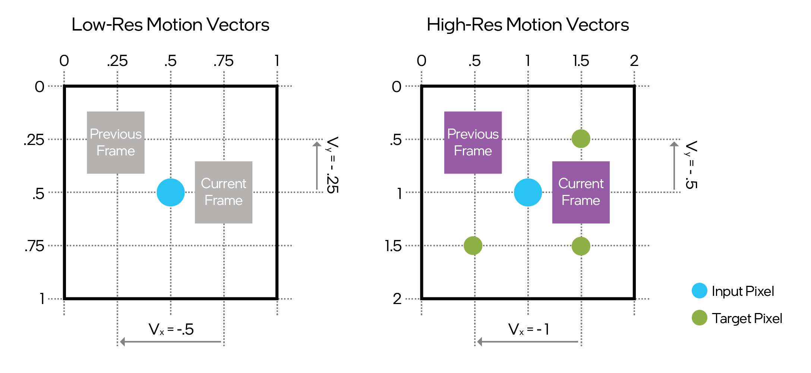
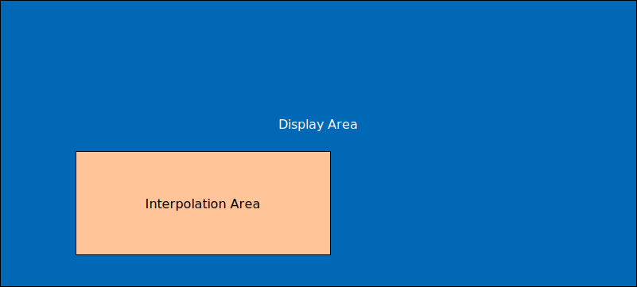

# Intel® XeSS Frame Generation (XeSS-FG) Developer Guide 1.2

Intel® XeSS Frame Generation (XeSS-FG) is an AI-based frame interpolation technology.
Using deep learning to generate detailed, high-resolution frames, XeSS-FG
improves gaming performance and fluidity without degrading image quality.

This document provides a guide for developers on how to integrate XeSS-FG into their applications.

Contents:

- [Introduction](#introduction)
- [Requirements](#requirements)
- [Deployment](#deployment)
- [Naming Conventions and Branding Guidance](#naming-conventions-and-branding-guidance)
- [Quick Start Guide](#quick-start-guide)
- [Programming Guide](#programming-guide)
  - [Context Creation](#context-creation)
  - [Logging Callback](#logging-callback)
  - [XeLL Link](#xell-link)
  - [Initialization](#initialization)
    - [Initialization Flags](#initialization-flags)
    - [UI Composition Modes](#ui-composition-modes)
      - [UI Composition Modes Comparison Table](#ui-composition-modes-comparison-table)
      - [Performance Implications](#performance-implications)
  - [Error Handling](#error-handling)
  - [HDR Display Support](#hdr-display-support)
  - [Enabling Frame Generation](#enabling-frame-generation)
  - [Inputs](#inputs)
    - [Resource Tagging](#resource-tagging)
    - [Motion Vectors](#motion-vectors)
    - [Depth](#depth)
    - [HUD-less Color Texture](#hud-less-color-texture)
    - [UI Texture](#ui-texture)
  - [Frame Constants](#frame-constants)
  - [Descriptor Heap](#descriptor-heap)
  - [Letterboxing](#letterboxing)
  - [Asynchronous Shader Compilation](#asynchronous-shader-compilation)
  - [Execution](#execution)
    - [Present Status](#present-status)
    - [Changing Window State](#changing-window-state)
  - [Shutdown](#shutdown)
  - [Implementation Details](#implementation-details)
  - [Compatibility with third-party Frame Generation Software](#compatibility-with-third-party-frame-generation-software)
  - [Debugging](#debugging)
  - [Versioning](#versioning)
- [Notices](#notices)

## Introduction

Intel® XeSS Frame Generation (XeSS-FG) is implemented as a sequence of compute shader passes,
executed before a presentation event to generate an additional frame. XeSS-FG provides
a proxy swap chain to simplify integration, abstracting the complexity of doing two
presents for every application-rendered frame with smooth presentation pacing.
Intel® XeSS-FG can be combined with other technologies to deliver the best experience on
both integrated and discrete graphics platforms. For optimal performance, we recommend the following
frame rate targets:

- **40 FPS minimum (XeSS-SR or native input specification):** This provides adequate reconstruction
  for fluid gameplay, making it ideal for entry-level graphics.
- **60 FPS recommended (XeSS-SR or native input specification):** This ensures the best latency
  experience with the most fluid gameplay, targeting high-end graphics.

XeSS-FG supports all vertical synchronization (VSYNC) and refresh rate modes (fixed refresh rate and variable refresh rate -
VRR). For best results, motion blur should be either disabled or modified to accommodate the
additional frames produced by XeSS-FG.

## Requirements

- Windows 10/11 x64 - 10.0.19043/22000 or later
- DirectX12
  - Intel® Arc™ Graphics with Intel® Xe Matrix eXtensions (XMX)
  - Intel® Graphics Driver Version 32.0.101.6252 or later
  - or any non-Intel GPU supporting Shader Model 6.4
- Intel® XeLL 1.2.0 or later

## Deployment

To use XeSS-FG in a project:

- Add `inc` folder to the include path
- Include `xefg_swapchain.h`, `xefg_swapchain_d3d12.h` and `xefg_swapchain_debug.h`
- Link with `lib/libxess_fg.lib`

The following file must be placed next to the executable or in the DLL search path:

- `libxess_fg.dll`
- Microsoft Visual C++ Redistributable 14.40.33810 or later. The following libraries are required:
  - `msvcp140.dll`
  - `vcruntime140.dll`
  - `vcruntime140_1.dll`

## Naming Conventions and Branding Guidance

Please see [“XeSS 2 Naming Structure and Examples”](xess_2_naming_structure_and_examples_english.md)
for approved naming conventions, branding guidance and settings menu examples.

## Quick Start Guide

XeSS-FG integration is a simple and straightforward process, especially when accompanied by
[XeSS Inspector](https://www.intel.com/content/www/us/en/developer/articles/technical/intel-xess-inspector.html)
tool. At first the
application must ensure it has all required inputs. If your application has support for XeSS-SR or
TAA, then almost all required resources are already present. The only resource that is required for
XeSS-FG but optional in XeSS-SR is the depth buffer. Here's the minimum set of required inputs:

- Motion vectors
  - Must be from the current frame to the previous.
  - `R16G16_FLOAT` or similar format.
  - Can be in normalized device coordinates (NDC) or pixel space.
  - Can be jittered.
  - Preferred to be low-res (same as input to Super Sampling or TAAU) but can also be high-res
    (target resolution).
- Depth buffer
  - Depth can be inverse.
  - Buffer size must be the same as the motion vectors buffer.
- Frame constants
  - View/Projection matrices required.
  - Optional jitter values if motion vectors are jittered.
  - Optional motion vector scale can be provided to match motion vector requirements.

> ***Important!** XeLL integration is a prerequisite for XeSS-FG integration.
> The application must provide an XeLL context to XeSS-FG before initialization – see [XeLL Link](#xell-link) for more details.
> Other latency reduction solutions are not supported.*

The following steps are required to properly integrate XeSS-FG into an application:

- Create XeSS-FG context.
  - Can be done at application start.
  - `xefgSwapChainD3D12CreateContext`
- Register logging callback.
  - `xefgSwapChainSetLoggingCallback`
- Link to XeLL context.
  - `xefgSwapChainSetLatencyReduction`
- Initialize context.
  - Should be done after swap chain creation.
  - `xefgSwapChainGetProperties`
  - `xefgSwapChainD3D12InitFromSwapChain` or `xefgSwapChainD3D12InitFromSwapChainDesc`
- Obtain a pointer to the XeSS-FG proxy swap chain.
  - This swap chain must be used instead of the application swap chain.
  - `xefgSwapChainD3D12GetSwapChainPtr`
- Tag resources.
  - Each required resource must be tagged each frame.
  - `xefgSwapChainD3D12TagFrameResource`
    - Required `XEFG_SWAPCHAIN_RES_MOTION_VECTOR`
    - Required `XEFG_SWAPCHAIN_RES_DEPTH`
  - `xefgSwapChainTagFrameConstants`
  - `xefgSwapChainD3D12SetDescriptorHeap` call is required prior to presentation if and only if
    `XEFG_SWAPCHAIN_INIT_FLAG_EXTERNAL_DESCRIPTOR_HEAP` was used during XeSS-FG initialization.
- Perform frame presentation.
  - `xefgSwapChainSetPresentId` must be called before presentation.
- The application can pause XeSS-FG.
  - `xefgSwapChainSetEnabled`
- The application should destroy the XeSS-FG context before termination.
  - `xefgSwapChainDestroy`
- Turn off or reduce motion blur when XeSS-FG is enabled.

## Programming Guide

XeSS-FG API provides an implementation of `IDXGISwapChain4` interface that applications can use instead of the native DXGI swap chain. This proxy swap chain produces additional frames and paces presentation to make sure that generated and application frames appear on the screen at the right time. On Intel® GPUs, the pacing is performed by the Intel® Graphics Driver. On GPUs from other vendors, the pacing is handled by a high-priority background thread that submits presents to an internally-managed high-priority direct queue.

> ***Important!** Frame generation delays presentation of the application frames, making XeLL integration critical for reducing latency. See [XeLL Link](#xell-link) for more details.*


*Figure 1. Library interaction with application's pipeline on Intel GPUs.*

If your application is using `GetLastPresentCount`, `GetFrameStatistics`, or a waitable swap chain, make sure to consult the [Implementation Details](#implementation-details) section to understand how these features interact with XeSS-FG.

### Context Creation

To use XeSS-FG the application must first create an XeSS-FG context:

```cpp
xefg_swapchain_handle_t xefgSwapChain = nullptr;
xefgSwapChainD3D12CreateContext(pD3D12Device, &xefgSwapChain);
```

It will check for the necessary feature capabilities of the provided device and
will fail if the supported feature level is insufficient. The application can query
additional information for resource handling and interpolation options by calling
`xefgSwapChainGetProperties`.

### Logging Callback

Once a context is created, the application can obtain additional diagnostic information by
registering a logging callback:

```cpp
static void logCallback(const char* message,
  xefg_swapchain_logging_level_t level, void* userData);

xefg_swapchain_logging_level_t logLevel = XEFG_SWAPCHAIN_LOGGING_LEVEL_WARNING;

xefgSwapChainSetLoggingCallback(xefgSwapChain, logLevel, logCallback, userData);
```

There are four verbosity levels of logging:

- `XEFG_SWAPCHAIN_LOGGING_LEVEL_DEBUG`
- `XEFG_SWAPCHAIN_LOGGING_LEVEL_INFO`
- `XEFG_SWAPCHAIN_LOGGING_LEVEL_WARNING`
- `XEFG_SWAPCHAIN_LOGGING_LEVEL_ERROR`

Use `XEFG_SWAPCHAIN_LOGGING_LEVEL_ERROR` for production and `XEFG_SWAPCHAIN_LOGGING_LEVEL_DEBUG` during development.

### XeLL Link

XeSS-FG requires a working XeLL integration. Please follow the [XeLL Developer
Guide](xell_developer_guide_english.md).

> ***Important!** XeSS-FG will fail to initialize without XeLL context,
> and frame generation will be disabled if XeLL is not initialized and enabled.*

XeSS-FG requires XeLL integration on all GPUs.

> ***Important!** Latency reduction solutions other than XeLL are not supported.
> Enabling them while using XeSS-FG is not supported and might lead to unexpected behavior.*

The application should call `xefgSwapChainSetLatencyReduction` to connect XeLL and XeSS-FG. The
application must use the same frame counter for both APIs.

```cpp
xefgSwapChainSetLatencyReduction(xefgSwapChain, xellContext);
```

Please make sure that XeLL context is available for the entire XeSS-FG context lifetime. The application can
disable XeLL when frame generation is disabled, but XeLL must be re-enabled before enabling frame
generation.

### Initialization

There are two ways to initialize XeSS-FG swap chain:

- `xefgSwapChainD3D12InitFromSwapChain`
  - Queries parameters from the provided swap chain.
  - The application must provide swap chain pointer with reference counter equal to `1`.
  - **Application-provided swap chain will be released!** Function will fail if it can't release
    swap chain.
  - After successful call, the provided swap chain pointer will be invalid.
  - Creates new swap chain for the underlying window.
  - Returns error in exclusive fullscreen mode.
- `xefgSwapChainD3D12InitFromSwapChainDesc`
  - Creates new swap chain for the provided window.
  - The application shouldn't have any swap chains associated with the provided window.
  - Won't fail in exclusive fullscreen mode but frame generation can't be enabled.

Once XeSS-FG is initialized the application must obtain a pointer to the proxy swap chain:

```cpp
ComPtr<IDXGISwapChain4> swapChain;
xefgSwapChainD3D12GetSwapChainPtr(xefgSwapChain, IID_PPV_ARGS(&swapChain));
```

> ***Important!** All interaction with the swap chain from that point on must be done by using the proxy swap chain exclusively!*

XeSS-FG will store a reference to the command queue provided during initialization and execute the
interpolation work using this queue. The application must ensure that lifetime of the command queue exceeds the lifetime of the XeSS-FG swap chain.

```cpp
ComPtr<IDXGISwapChain4> swapChain = CreateApplicationSwapChain();

xefg_swapchain_d3d12_init_params_t initParams = {};
initParams.pApplicationSwapChain = swapChain.Detach();
initParams.maxInterpolatedFrames = 1;

xefgSwapChainD3D12InitFromSwapChain(xefgSwapChain, commandQueue.Get(), &initParams);

xefgSwapChainD3D12GetSwapChainPtr(xefgSwapChain, IID_PPV_ARGS(&swapChain));
```

Please note that XeSS-FG is disabled by default and can be enabled by calling
`xefgSwapChainSetEnabled`. See [Enabling Frame Generation](#enabling-frame-generation) for more details.

XeSS-FG allocates GPU resources of one of the two categories:

- **Persistent allocations**, such as network weights, and other constant data.
- **Temporary allocations**, such as network activations.

The application can optionally provide external heaps for XeSS-FG resources. The application
can obtain the required heap sizes by calling `xefgSwapChainGetProperties`. These heaps must have `D3D12_HEAP_TYPE_DEFAULT` type and, to ensure optimal performance,
have memory residency priority `D3D12_RESIDENCY_PRIORITY_HIGH`.

The application should pass heap pointers and
offsets by setting corresponding fields of `xefg_swapchain_d3d12_init_params_t`. The offsets must be 64KB aligned.

The application can also optionally provide an external descriptor heap, which XeSS-FG will use for internal resource descriptors. The required amount of descriptors can be obtained by calling
`xefgSwapChainGetProperties`. In this case, the application must set `XEFG_SWAPCHAIN_INIT_FLAG_EXTERNAL_DESCRIPTOR_HEAP` flag
during initialization and pass the descriptor heap and the offset by calling
`xefgSwapChainD3D12SetDescriptorHeap`. The descriptor heap must have type
`D3D12_SRV_UAV_CBV_DESCRIPTOR_HEAP` and be shader-visible.

#### Initialization Flags

The application can use initialization flags to customize XeSS-FG behavior:

- `XEFG_SWAPCHAIN_INIT_FLAG_NONE` – default
- `XEFG_SWAPCHAIN_INIT_FLAG_INVERTED_DEPTH` – depth texture uses inverted values
- `XEFG_SWAPCHAIN_INIT_FLAG_EXTERNAL_DESCRIPTOR_HEAP` – use application-provided external
  descriptor heap
- `XEFG_SWAPCHAIN_INIT_FLAG_HIGH_RES_MV` – high-res motion vectors texture (swap chain resolution)
- `XEFG_SWAPCHAIN_INIT_FLAG_USE_NDC_VELOCITY` – motion vectors use NDC
- `XEFG_SWAPCHAIN_INIT_FLAG_JITTERED_MV` – motion vectors are not un-jittered
- `XEFG_SWAPCHAIN_INIT_FLAG_UITEXTURE_NOT_PREMUL_ALPHA` – RGB values in the UI texture are not
  pre-multiplied by the corresponding alpha value from the alpha channel

#### UI Composition Modes

XeSS-FG offers several options for handling user interface (UI) elements for interpolated frames.
The application may provide additional resources:

- **HUD-less color** - A full scene color buffer with all post-processing applied, same texture
  format and color space as the back buffer, but without any UI or HUD elements.
- **UI-only texture** - A texture that contains only the UI / HUD elements with appropriate alpha
  values to denote transparency, same texture format and color space as the back buffer. The
  contents of this UI-only texture must satisfy the following formula:

  ```py
  FinalColor.RGB = UIonly.RGB + (1 - UIonly.Alpha) * HUDlessColor.RGB
  ```

> ***Important!** For better UI composition quality and to minimize UI distortions, the application must provide both additional resources: HUD-less color and UI-only texture.*

By default, XeSS-FG uses `XEFG_SWAPCHAIN_UI_MODE_AUTO` UI composition mode: it automatically determines the best UI handling mode based on the
resources tagged by the application (HUD-less color and UI-only texture).

The application can explicitly select a UI composition mode. With both HUD-less color and UI-only texture resources provided,
the application can use one of the following UI composition modes:

- `XEFG_SWAPCHAIN_UI_MODE_HUDLESS_UITEXTURE` - Interpolates on the HUD-less color texture and blends
  UI from the UI texture with alpha using the formula above. **Use this mode if** the application can
  provide a UI texture completely satisfying the formula.

- `XEFG_SWAPCHAIN_UI_MODE_BACKBUFFER_HUDLESS_UITEXTURE` - Interpolates on the HUD-less color texture
  and blends UI from the UI texture with additional UI refinement by UI extraction from the
  back buffer. **Use this mode if** the application can provide the UI texture but doesn't completely
  satisfy the blending formula. For example, this is the preferred option for Unreal Engine\*-based
  applications.

In case either one or both additional resources cannot be provided by the application:

- `XEFG_SWAPCHAIN_UI_MODE_BACKBUFFER_HUDLESS` - Interpolates on the HUD-less color texture and
  extracts the UI from the back buffer. The resulting visual quality of the UI composition may be
  worse than if the UI-only texture is also provided, especially for semi-transparent UI elements. **Use
  this mode if** the application cannot provide the UI-only texture but can provide HUD-less color texture.

- `XEFG_SWAPCHAIN_UI_MODE_BACKBUFFER_UITEXTURE` - Interpolates on the back buffer and refines the UI
  using the UI texture with alpha. **Use this mode if** the application cannot provide the HUD-less color
  texture but can provide an UI-Only texture.

- `XEFG_SWAPCHAIN_UI_MODE_NONE` - Interpolates on the back buffer without any special UI handling.
  This mode is ***not recommended*** as it may produce unacceptable visual artifacts on the UI elements.

##### UI Composition Modes Comparison Table

The following table shows what resources must be provided for different UI composition modes:

| **ID** | **Mode Name** | **HUD-less Color** | **UI-Only Texture** |
| --- | --- | --- | --- |
| 0 | `AUTO` | Optional | Optional |
| 1 | `NONE` | Not Used | Not Used |
| 2 | `BACKBUFFER_UITEXTURE` | Not Used | Required |
| 3 | `HUDLESS_UITEXTURE` | Required | Required |
| 4 | `BACKBUFFER_HUDLESS` | Required | Not Used |
| 5 | `BACKBUFFER_HUDLESS_UITEXTURE` | Required | Required |

##### Performance Implications

Each UI composition mode has different performance characteristics. For instance, modes that require
additional inputs, such as the UI-only texture, may incur a slight performance overhead due to the
extra processing needed for blending. Here is an overview of the performance impact for each mode:

- `XEFG_SWAPCHAIN_UI_MODE_NONE` - no performance impact as it does not perform any
  additional processing for UI elements.
- `XEFG_SWAPCHAIN_UI_MODE_BACKBUFFER_HUDLESS_UITEXTURE` - slightly higher performance overhead than other modes,
  but provides the most robust composition of the UI elements.
- **All other modes** - minor performance overhead due to additional processing
  for UI handling, such as texture blending and UI extraction from the back buffer.

### Error Handling

When integrating XeSS-FG into your application, it is important to handle potential errors that may
arise during the selection and use of UI handling modes. Below are common error scenarios:

- **Invalid Mode** - If provided value is not a constant from `xefg_swapchain_ui_mode_t`. The
  library will return `XEFG_SWAPCHAIN_RESULT_ERROR_INVALID_ARGUMENT` error code on the
  initialization, indicating an invalid mode selection.
- **Missing Resources** - If the HUD-less color or UI-only texture is missing when required
  by the selected mode, XeSS-FG will report `XEFG_SWAPCHAIN_RESULT_ERROR_MISMATCH_INPUT_RESOURCES`
  using [Present Status](#present-status).

### HDR Display Support

XeSS-FG provides support for High Dynamic Range (HDR) displays with the `R10G10B10A2_UNORM` pixel
format. When using HDR, the back buffer, HUD-less color and UI-only texture must have the same
pixel format and must be in HDR10 / BT.2100 color space. Since 2-bit alpha may not be enough to
represent semi-transparent UI elements, switching UI composition mode to
`XEFG_SWAPCHAIN_UI_MODE_BACKBUFFER_HUDLESS_UITEXTURE` may help avoid flicker.

Please note that XeSS-FG
does not support the FP16 HDR format and scRGB color space. Refer to
<https://learn.microsoft.com/en-us/windows/win32/direct3darticles/high-dynamic-range#option-2-use-uint10rgb10-pixel-format-and-hdr10bt2100-color-space>
for more details.

### Enabling Frame Generation

After creating the context and the proxy swap chain, the application can enable frame generation by
calling:

```cpp
xefgSwapChainSetEnabled(xefgSwapChain, true);
```

When enabling frame generation, the application must ensure that XeLL latency reduction is enabled.

Frame generation cannot be enabled while the application is in the fullscreen exclusive mode. If
the application enters fullscreen exclusive mode while XeSS-FG is enabled, frame generation will be
disabled and the swap chain will work in a passthrough mode, i.e., just presenting application-rendered
frames. After leaving fullscreen exclusive mode, `xefgSwapChainSetEnabled` must
be called again to enable frame generation.

The application can toggle XeSS-FG on or off at any time. Each call to disable will mark input history
for cleanup next time frame generation is enabled.

It is recommended to disable XeSS-FG when the application is displaying a full-screen menu or paused.

When XeSS-FG is disabled, the proxy swap chain still has a small overhead from copying the back buffers.

### Inputs

XeSS-FG requires the following set of inputs for every frame:

- Velocity texture (Motion Vectors)
- Depth texture
- Set of frame constants

Depending on the selected UI composition mode the application may need to provide additional resources:

- HUD-less color texture
- UI texture

It is important that dimensions of all resources except for motion vectors and depth match the
back buffer dimensions. If the application needs to change resource size, it must re-initialize XeSS-FG.

The application provides inputs to XeSS-FG by tagging them:

- `xefgSwapChainD3D12TagFrameResource` for motion vectors, depth, HUD-less color, UI textures, and back buffer (for letterboxing)
- `xefgSwapChainTagFrameConstants` for frame constants

XeSS-FG automatically has access to the back buffer via the proxy swap chain. However, if the application needs to
restrict the interpolation area, it will need to tag the back buffer resource - see [Letterboxing](#letterboxing) for more details.

If the application initialized XeSS-FG with `XEFG_SWAPCHAIN_INIT_FLAG_EXTERNAL_DESCRIPTOR_HEAP`, it
must provide descriptor heap before the call to `Present` or `Present1`.

#### Resource Tagging

Each call to tag a resource must specify one of following resource validity modes:

- `XEFG_SWAPCHAIN_RV_UNTIL_NEXT_PRESENT` – resource will be alive until the next present call. XeSS-FG will use this to defer or avoid making a copy.
- `XEFG_SWAPCHAIN_RV_ONLY_NOW` – resource is only valid now and XeSS-FG will
  record a copy operation to the provided command list.

The application must provide valid state for each tagged resource: XeSS-FG will add appropriate
state transition barriers from/to the provided state. To minimize the number of state transitions,
use the following states depending on resource validity:

- For `XEFG_SWAPCHAIN_RV_UNTIL_NEXT_PRESENT` use `D3D12_RESOURCE_STATE_NON_PIXEL_SHADER_RESOURCE`.
- For `XEFG_SWAPCHAIN_RV_ONLY_NOW` use `D3D12_RESOURCE_STATE_COPY_SOURCE`.

Here is an example of resource tagging for HUD-less color:

```cpp
xefg_swapchain_d3d12_resource_data_t hudlessColor = {};
hudlessColor.type = XEFG_SWAPCHAIN_RES_HUDLESS_COLOR;
hudlessColor.validity = XEFG_SWAPCHAIN_RV_UNTIL_NEXT_PRESENT;
hudlessColor.resourceSize = { width, height };
hudlessColor.pResource = renderTargets[frameIndex];
hudlessColor.incomingState = D3D12_RESOURCE_STATE_NON_PIXEL_SHADER_RESOURCE;

xefgSwapChainD3D12TagFrameResource(
  xefgSwapChain, commandList.Get(), frameCounter, &hudlessColor);
```

[XeSS Inspector](https://www.intel.com/content/www/us/en/developer/articles/technical/intel-xess-inspector.html) can help catch resource tagging issues early.

#### Motion Vectors

Motion vectors specify the screen-space motion in pixels from the current frame to the previous
frame. If the application uses NDC for motion vectors it should pass an additional flag
(`XEFG_SWAPCHAIN_INIT_FLAG_USE_NDC_VELOCITY`) during XeSS-FG context initialization. XeSS-FG accepts
motion vectors in the format `R16G16_FLOAT` or similar, where the R channel encodes the motion in x,
and the G channel motion in y. The motion vectors do not include motion induced by the camera
jitter. Motion vectors can be low-res (default and recommended), or high-res. Low-res motion vectors
are represented by a 2D texture at the resolution of the input to Super Sampling pass or TAAU,
whereas high-res motion vectors are represented by a 2D texture at the target resolution.

> ***Important!** Using high-res motion vectors can greatly reduce performance of frame generation
> especially in higher resolutions, and it is generally recommended to use low-res motion vectors.*

In the case of high-res motion vectors, the velocity component resulting from camera animations is
computed at the target resolution in a deferred pass, using the camera transformation and depth
values. However, the velocity component related to particles and object animations is typically
computed at the input resolution and stored in the G-Buffer. This velocity component is upsampled
and combined with the camera velocity to produce the texture for high-res motion vectors. XeSS-FG
also expects the high-res motion vectors to be [dilated](http://behindthepixels.io/assets/files/TemporalAA.pdf).
For example, the motion vectors represent the motion of the foremost surface in a small neighborhood of input pixels (such as 3 \* 3).
High-res motion vectors can be computed in a separate pass by the user.

Low-res motion vectors are not dilated, and directly represent the velocity sampled at each jittered
pixel position. XeSS-FG internally upsamples motion vectors to the target grid and uses the depth
texture to dilate them. Figure 2 shows the same motion specified with low-res and high-res motion
vectors.

 *Figure 2. Convention for specifying
the low-res and high-res motion vector to XeSS-FG.*

Some game engines only render objects into the G-Buffer, and quickly compute the camera velocity in
the TAA shader. In such cases, an additional pass is required before XeSS-FG execution to merge
object and camera velocities and generate a flattened velocity buffer. In such scenarios, high-res
motion vectors might be a better choice, as the flattening pass can be executed at the target
resolution.

#### Depth

Any depth format, such as `D32_FLOAT` or `D24_UNORM`, is supported. By default, XeSS-FG assumes that
smaller depth values are closer to the camera. However, inverted depth can be enabled by setting
`XEFG_SWAPCHAIN_INIT_FLAG_INVERTED_DEPTH`.

Buffer size must be the same as the Motion Vectors buffer size.

#### HUD-less Color Texture

HUD-less color texture is a full scene color texture with all post-processing applied, identical in
color space and size to the back buffer, but without any UI or HUD elements.

HUD-less texture format must be the same as the back buffer format.

#### UI Texture

UI texture is a texture that contains only UI elements, including HUD, with appropriate alpha
values to denote transparency. The contents of the UI-only texture must satisfy the following formula:

```py
FinalColor.RGB = UIonly.RGB + (1 - UIonly.Alpha) * HUDlessColor.RGB
```

This texture should have the same texture format, color space, and size as the back buffer.

### Frame Constants

The application must provide a `xefg_swapchain_frame_constant_data_t` structure on each frame to
properly update the configuration and set up the scene data by calling
`xefgSwapChainTagFrameConstants`. The structure includes the following data:

- `viewMatrix` - scene view matrix in a row-major order without applied jitter
- `projectionMatrix` - camera projection matrix in a row-major order without applied jitter
- `jitterOffsetX/Y` - jitter offset in a range `[-0.5, 0.5]`
- `motionVectorScaleX/Y` - motion vector scale factors
- `resetHistory` – if this flag is set, XeSS-FG will ignore previous inputs and won't perform
  interpolation for current frame
- `frameRenderTime` – frame render time on GPU in milliseconds

On non-Intel GPUs, XeSS-FG uses `frameRenderTime` to guide presentation pacing.

Example:

```cpp
xefg_swapchain_frame_constant_data_t constData = {};

float fx = m_constantBufferData.offset.x;
float fy = m_constantBufferData.offset.y;

XMFLOAT4X4 float4x4;

XMStoreFloat4x4(&float4x4, DirectX::XMMatrixTranslation(fx, fy, 0));
memcpy(constData.viewMatrix, float4x4.m, sizeof(float) * 16);

XMStoreFloat4x4(&float4x4, DirectX::XMMatrixIdentity());
memcpy(constData.projectionMatrix, float4x4.m, sizeof(float) * 16);

constData.jitterOffsetX = constData.jitterOffsetY = 0.0f;
constData.motionVectorScaleX = constData.motionVectorScaleY = 1.0f;

xefgSwapChainTagFrameConstants(xefgSwapChain, frameCounter, &constData);
```

### Descriptor Heap

If XeSS-FG was initialized with `XEFG_SWAPCHAIN_INIT_FLAG_EXTERNAL_DESCRIPTOR_HEAP`, the application must
provide an external descriptor heap before calling `Present` or `Present1`:

```cpp
xefgSwapChainD3D12SetDescriptorHeap(xefgSwapChain, descriptorHeap, offset);
```

The provided descriptor heap must have at least
`xefg_swapchain_properties_t::requiredDescriptorCount` entries to accommodate all descriptors used by XeSS-FG during interpolation.

Be mindful when providing different offsets or different heaps per frame as the GPU may still be executing frame generation while the next frame is being recorded by the application. Once the
descriptor heap and the offset are no longer in use, they can be provided for frame generation again.

### Letterboxing

**Display area**: the size of the back buffer. Defined by the swap chain initialization.

**Interpolation area**: a region of interest within the color resource (HUD-less, back buffer, UI)
for the interpolation. Defined by the resource size and offset.

To achieve the letterboxing effect, XeSS-FG supports partial frame interpolation, i.e. interpolation
within a defined interpolation area. The image below shows the relationship between interpolation
and display areas inside the back buffer resource.


*Figure 3. Relationship between interpolation and display areas.*

The application can specify the interpolation area during resource tagging by setting the `resourceSize` and `resourceBase` fields of
the `xefg_swapchain_d3d12_resource_data_t` structure.

The application must follow this procedure to enable letterboxing:

- Initialize or re-initialize XeSS-FG with the required display size.
- For each frame:
  - Tag HUD-less and/or UI resources by calling
     `xefgSwapChainD3D12TagFrameResource` with `resourceSize` and `resourceBase` fields
     set to the size and the offset of the interpolation area.
  - Tag the back buffer by calling
     `xefgSwapChainD3D12TagFrameResource` with `resourceSize` and `resourceBase` fields
     set to the size and the offset of the interpolation area,
     and `type` field set to `XEFG_SWAPCHAIN_RES_BACKBUFFER`. In this case
     other data members of the provided resource data get ignored.

The interpolation will work only when the following conditions are met:

- The interpolation area (width and height) in HUDless, UI, and back buffer resources is the same
  for a given frame.
- The interpolation area (width and height) is the same in the previous and next frames.

Otherwise, interpolation will be skipped, and the previously rendered frame will be presented.

During the interpolation execution, the display area in the back buffer is entirely filled by the
XeSS-FG:

- Pixels inside the interpolation area are interpolated.
- Pixels outside the interpolation area are copied from the previously generated back buffer
  resource.

### Asynchronous Shader Compilation

To improve overall startup time, XeSS-FG supports asynchronous shader compilation:

- Create the XeSS-FG context early during initialization.
- Right after that call `xefgSwapChainD3D12BuildPipelines` in non-blocking mode. XeSS-FG will
  immediately start compiling kernels in the background, while the application is loading.
- Initialize XeSS-FG swap chain at a later time (e.g., when the user chooses it in the menu).
  By that time compilation has hopefully finished.
- The compilation status can be queried at a later stage by calling `xefgSwapChainGetPipelineBuildStatus`.

Swap chain initialization will automatically wait for the compilation to finish.

### Execution

XeSS-FG automatically submits interpolation shaders for execution when the application calls `Present`
on the proxy swap chain. The application must ensure that the command queue provided during initialization is still valid and
that all command lists used for resource tagging have been submitted for execution.

> ***Important!** The application must call `xefgSwapChainSetPresentId` before calling `Present` to identify resources tagged for this frame.
> Failure to make this call will result in visible artifacts or XeSS-FG skipping interpolation.*

```cpp
xefgSwapChainSetPresentId(xefgSwapChain, frameCounter);

++frameCounter;

swapChain->Present(1, 0);
```

#### Present Status

The application can query status of the last `Present` by calling `xefgSwapChainGetLastPresentStatus`.
It populates the provided `xefg_swapchain_present_status_t` structure with the last interpolation result,
number of frames queued for the presentation, and an indicator of whether XeSS-FG was enabled.

```cpp
xefg_swapchain_present_status_t lastPresentStatus = {};
xefgSwapChainGetLastPresentStatus(xefgSwapChain, &lastPresentStatus);
```

> ***Important!** Call `xefgSwapChainGetLastPresentStatus` as soon as possible after `Present`, before the next call
to `xefgSwapChainSetPresentId`.*

When frame generation is disabled, `xefgSwapChainGetLastPresentStatus` will report zero presented frames even if the application frame was presented. This is a known limitation and it will be fixed in a future release.

#### Changing Window State

When the application is resizing the window or changing the fullscreen state, it needs to call `IDXGISwapChain::ResizeBuffers`.
In addition to releasing references to back buffers before calling `ResizeBuffers`,
the application must wait for the execution of command lists used for resource tagging,
because the command lists may reference resources owned by the proxy swap chain.
If the command lists haven't been submitted for execution, the application can simply reset them.

XeSS-FG ignores the queues provided to `IDXGISwapChain3::ResizeBuffers1` substituting them with an internally-managed queue instead.

### Shutdown

Before calling `xefgSwapChainDestroy` to destroy the context the application must ensure that:

- The XeSS-FG context is no longer being used: no resource or constants tagging or enabling/disabling.
- All references to the XeSS-FG swap chain have been released.
- **XeLL context is still available**: XeSS-FG context should be destroyed before the XeLL context.

Calling `xefgSwapChainDestroy` will release all resources owned by the frame generation context. The function will return an error if the application
has any outstanding references to the proxy swap chain object obtained by calling `xefgSwapChainD3D12GetSwapChainPtr`.

Calling `xefgSwapChainDestroy` will destroy the underlying native swap chain.

### Implementation Details

XeSS-FG implementation of `IDXGISwapChain4` interface is designed to look and feel as if there is no
frame generation and the application can treat it as a native swap chain. However, there are a few notable exceptions.
Some methods of the swap chain interface are implemented by forwarding the call
directly to the native DXGI swap chain. This may have important implications for the application.

In particular, the following methods are forwarded directly to the underlying swap chain:

- Methods of `IDXGISwapChain` interface:
  - `GetFrameStatistics`
  - `GetLastPresentCount`
- Methods of `IDXGISwapChain2` interface:
  - `SetSourceSize`
  - `GetSourceSize`
  - `SetMaximumFrameLatency`
  - `GetMaximumFrameLatency`
  - `GetFrameLatencyWaitableObject`

The application should take care when using these methods, as they do not take frame generation
into account and may return unexpected results. For example, the value reported by `GetLastPresentCount`
will include both application-rendered and generated frames as opposed to only application-rendered frames
(the number of times the application called `Present` or `Present1`): if the application expects
`GetLastPresentCount` to increment by one for each call to `Present`, it may observe the value increment
by two when frame generation is enabled. Similarly, `GetFrameStatistics` will report
statistics that include both application-rendered and generated frames.

If the application is using waitable swap chains, it should account for the fact that, when frame
generation is enabled, `Present` and `Present1` calls present two frames instead of one.

### Compatibility with third-party Frame Generation Software

XeSS-FG is not compatible with any third-party frame generation software. If the application wants
to switch from XeSS-FG to any other frame generation technology, it must fully shutdown XeSS-FG. If
the application wants to switch to XeSS-FG, it should shut down any other running frame generation
technology and perform full initialization starting from swap chain creation. XeSS-FG does not
support sharing of the swap chain with any other libraries.

### Debugging

The first step is to register a logging callback and check all relevant log messages. For deeper
investigations there are two additional tools – [XeSS Inspector
tool](https://www.intel.com/content/www/us/en/developer/articles/technical/intel-xess-inspector.html)
and an API for debug options:

- `XEFG_SWAPCHAIN_DEBUG_FEATURE_SHOW_ONLY_INTERPOLATION` – only generated frames will be seen on the
  screen. If frame generation fails, then the current back buffer will be presented instead. This
  behavior can be changed by the additional flag
  `XEFG_SWAPCHAIN_DEBUG_FEATURE_PRESENT_FAILED_INTERPOLATION`.
- `XEFG_SWAPCHAIN_DEBUG_FEATURE_TAG_INTERPOLATED_FRAMES` – showing purple boxes and vertical lines
  on the interpolated frame to distinguish it from the rendered one, as well as visually inspect
  tearing issues
- `XEFG_SWAPCHAIN_DEBUG_FEATURE_PRESENT_FAILED_INTERPOLATION` – enables black frame presentation if
  the interpolation failed, otherwise the current back buffer will be presented.

Debug options can be enabled using `xefgSwapChainEnableDebugFeature`. This function can be called at
any time between context creation and destruction.

```cpp
xefgSwapChainEnableDebugFeature(xefgSwapChain,
  XEFG_SWAPCHAIN_DEBUG_FEATURE_SHOW_ONLY_INTERPOLATION, true,
  nullptr);
```

### Versioning

The library uses a `<major>.<minor>.<patch>` versioning format, and Numeric 90+ scheme, for
development stage builds. The version is specified by a 64-bit sized structure
(`xefg_swapchain_version_t`), in which:

- A major version increment indicates a new API, and potentially a break in functionality.
- A minor version increment indicates an API improvement such as optional inputs or flags.
- A patch version increment may include performance or quality tweaks or fixes for known issues.

The version is baked into the XeSS-FG SDK release and can be accessed using the function
`xefgSwapChainGetVersion`.

## Notices

You may not use or facilitate the use of this document in connection with any infringement or other
legal analysis concerning Intel products described herein. You agree to grant Intel a non-exclusive,
royalty-free license to any patent claim thereafter drafted which includes subject matter disclosed
herein.

Performance varies by use, configuration, and other factors. Learn more at
[www.intel.com/PerformanceIndex](https://www.intel.com/PerformanceIndex).

No product or component can be absolutely secure.

All product plans and roadmaps are subject to change without notice.

Your costs and results may vary.

Intel technologies may require enabled hardware, software, or service activation.

Intel technologies' features and benefits depend on system configuration and may require enabled
hardware, software or service activation. Performance varies depending on system configuration.
Check with your system manufacturer or retailer or learn more at [intel.com](http://www.intel.com/).

No license (express or implied, by estoppel or otherwise) to any intellectual property rights is
granted by this document.

Intel disclaims all express and implied warranties, including without limitation, the implied
warranties of merchantability, fitness for a particular purpose, and non-infringement, as well as
any warranty arising from course of performance, course of dealing, or usage in trade.

This document contains information on products, services and/or processes in development. All
information provided here is subject to change without notice. Contact your Intel representative to
obtain the latest forecast, schedule, specifications, and roadmaps.

The products and services described may contain defects or errors known as errata which may cause
deviations from published specifications. Current characterized errata are available on request.

Copies of documents which have an order number and are referenced in this document may be obtained
by calling 1-800-548-4725 or by visiting
[www.intel.com/design/literature.htm](http://www.intel.com/design/literature.htm).

Microsoft, Windows, and the Windows logo are trademarks, or registered trademarks of Microsoft
Corporation in the United States and/or other countries.

© 2025 Intel Corporation. Intel, the Intel logo, and other Intel marks are trademarks of Intel
Corporation or its subsidiaries. Other names and brands may be claimed as the property of others.
