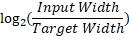
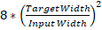
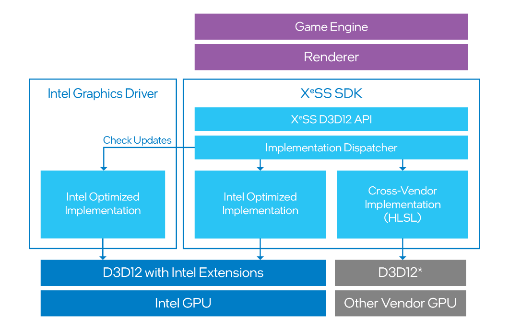
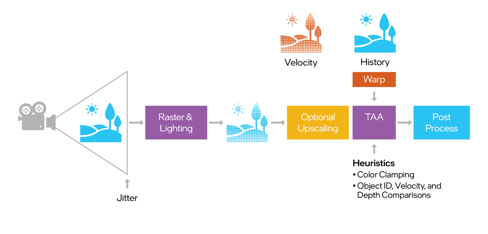
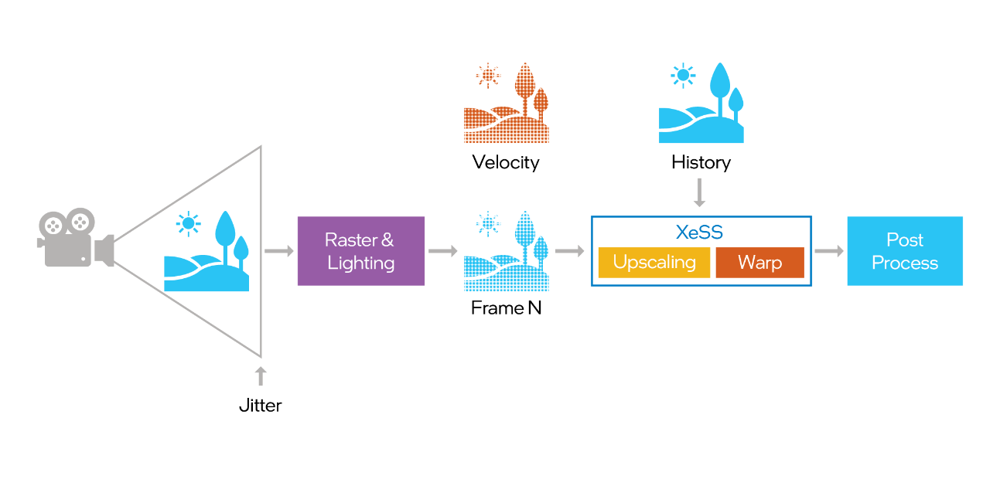
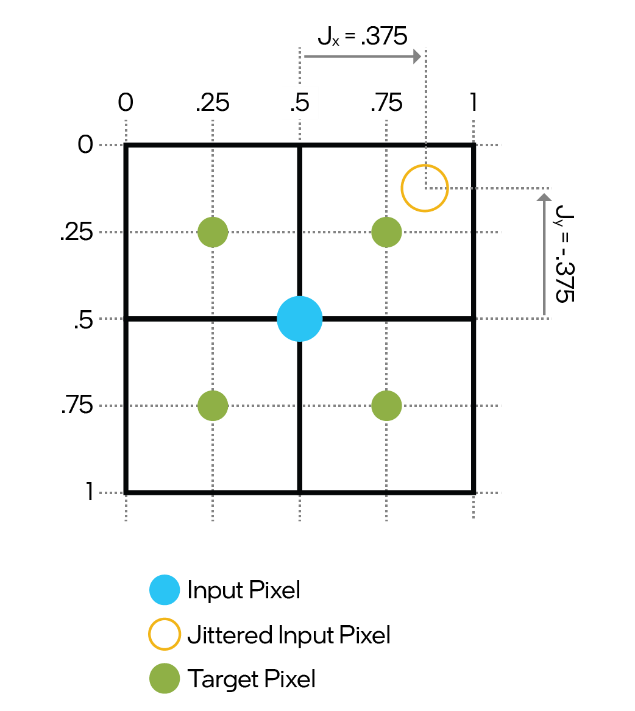
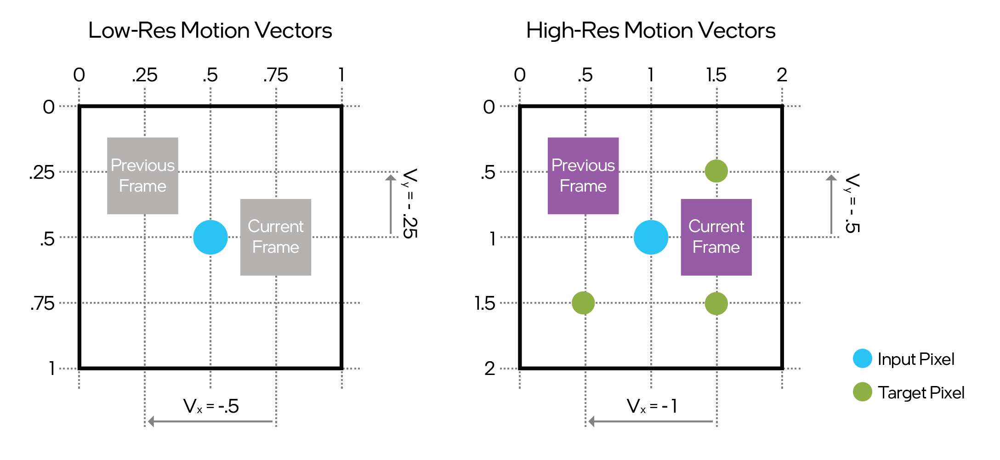

# Intel® XeSS Super Resolution (XeSS-SR) Developer Guide 2.0

Intel® XeSS Super Resolution (XeSS-SR) delivers innovative, framerate-boosting technology, which is
supported by Intel® Arc™ Graphics and other GPU vendors. By upscaling the image with AI deep
learning, it offers higher framerates at no cost to image quality.

Table of Contents

- [Introduction](#introduction)
  - [Update from XeSS 1.2 and older versions](#update-from-xess-12-and-older-versions)
  - [XeSS-SR Components](#xess-sr-components)
    - [Compatibility](#compatibility)
  - [Requirements](#requirements)
  - [TAA and XeSS-SR](#taa-and-xess-sr)
  - [Game Setting Recommendations](#game-setting-recommendations)
    - [Naming Conventions and Branding Guidance](#naming-conventions-and-branding-guidance)
    - [Graphics and Launcher Settings](#graphics-and-launcher-settings)
    - [Graphics Preset Default Recommendations](#graphics-preset-default-recommendations)
  - [Deployment](#deployment)
- [Programming Guide](#programming-guide)
  - [Thread safety](#thread-safety)
  - [Inputs and Outputs](#inputs-and-outputs)
    - [Jitter](#jitter)
      - [Jitter Sequence](#jitter-sequence)
    - [Color](#color)
    - [Motion Vectors](#motion-vectors)
    - [Depth](#depth)
    - [Responsive Pixel Mask](#responsive-pixel-mask)
    - [Output](#output)
    - [Resource States](#resource-states)
    - [Resource Formats](#resource-formats)
      - [Resource Formats D3D12 and D3D11 specific](#resource-formats-d3d12-and-d3d11-specific)
    - [Mip Bias](#mip-bias)
  - [Initialization](#initialization)
    - [Initialization D3D12 specific](#initialization-d3d12-specific)
    - [Initialization D3D11 specific](#initialization-d3d11-specific)
    - [Initialization Vulkan specific](#initialization-vulkan-specific)
    - [Logging Callback](#logging-callback)
  - [Execution](#execution)
    - [Execution D3D12 specific](#execution-d3d12-specific)
    - [Execution D3D11 specific](#execution-d3d11-specific)
    - [Execution Vulkan specific](#execution-vulkan-specific)
    - [Fixed Input Resolution](#fixed-input-resolution)
    - [Dynamic Input Resolution](#dynamic-input-resolution)
    - [Jitter Scale](#jitter-scale)
    - [Velocity Scale](#velocity-scale)
    - [Exposure Multiplier](#exposure-multiplier)
- [Recommended Practices](#recommended-practices)
- [Visual Quality](#visual-quality)
  - [Driver Verification](#driver-verification)
  - [Debugging Tips](#debugging-tips)
    - [Motion Vectors Debugging](#motion-vectors-debugging)
    - [Jitter Offset Debugging](#jitter-offset-debugging)
  - [Versioning](#versioning)
- [Additional Resources](#additional-resources)
- [Notices](#notices)

## Introduction

Intel® XeSS Super Resolution (XeSS-SR) is an AI-based temporal super sampling and anti-aliasing
technology, implemented as a sequence of compute shader passes, which is executed before the
post-processing stage (as described in the section entitled 'TAA and XeSS-SR'). It generally accepts
rendered low-resolution aliased jittered color as input, as well as motion vectors and depth from
the game, and produces upsampled anti-aliased color buffer at target resolution.

### Update from XeSS 1.2 and older versions

XeSS 1.3 introduced new Ultra-Performance (3.0x upscaling), Ultra Quality Plus (1.3x), Native
Anti-Aliasing (1.0x upscaling) presets, and **increases** [**resolution
scaling**](#fixed-input-resolution) **for existing quality presets**:

| **Preset** | **Resolution scaling in previous XeSS-SR versions** | **Resolution scaling in**  **XeSS 1.3+** |
| --- | --- | --- |
| Native Anti-Aliasing | N/A | 1.0x (Native resolution) |
| Ultra Quality Plus | N/A | 1.3x |
| Ultra Quality | 1.3x | 1.5x |
| Quality | 1.5x | 1.7x |
| Balanced | 1.7x | 2.0x |
| Performance | 2.0x | 2.3x |
| Ultra Performance | N/A | 3.0x |
| Off | Turns Intel XeSS-SR off | Turns Intel XeSS-SR off |

**When updating to XeSS-SR 1.3+ from previous XeSS-SR versions, it is critical to verify the XeSS-SR
integration in the game is satisfying the following:**

- Resolution scaling ratios, additional mip bias and jitter sequence length should not be hardcoded
  per quality preset in the game code. Corresponding function calls and formulas should be used in
  the runtime
- `xessGetOptimalInputResolution` function should be used to query input resolution
- Additional texture mip bias should be calculated using the formula:
  
  For example, XeSS 1.3
  Performance quality preset should result in additional mip bias of `-1.202`, and XeSS 1.3 Ultra
  Performance quality preset should result in additional mip bias of `-1.585`.
- Jitter sequence length must be at least:
  
  For example, XeSS
  1.3 Ultra Performance quality preset should use at least `72`.

Please refer to the corresponding sections of this document for more details.

### XeSS-SR Components

XeSS-SR is accessible through the XeSS-SR SDK, which provides an API for integration into a game
engine, and includes the following components:

- An HLSL-based cross-vendor implementation that runs on any GPU supporting SM 6.4. Hardware
  acceleration for DP4a or equivalent is recommended.
- An Intel implementation optimized to run on Intel® Arc™ Graphics, and Intel® Iris® Xe Graphics.
- An implementation dispatcher, which loads either the XeSS-SR runtime shipped with the game, the
  version provided with the Intel® Graphics driver, or the cross-vendor implementation.

 *Figure 1. XeSS-SR SDK D3D12
components for both Intel-specific, and cross-vendor solutions.*

#### Compatibility

All future Intel® Graphics driver releases provide compatibility with previous XeSS-SR versions.

During initialization XeSS-SR will check driver compatibility and choose which version to use – the
version distributed with an application or the version bundled with the driver.

### Requirements

- Windows 10/11 x64 - 10.0.19043/22000 or later
- DirectX12
  - Intel® Iris® Xe GPU or later
  - Other vendor GPU supporting SM 6.4 and with hardware acceleration for DP4a
- DirectX11
  - Intel® Arc™ Graphics or later
- Vulkan 1.1
  - Intel® Iris® Xe GPU or later
  - use SDK functions to query for required instance and device extensions and device features
  - Other vendor GPU supporting `shaderStorageImageWriteWithoutFormat` and
    `mutableDescriptorType` features

### TAA and XeSS-SR

XeSS-SR is a temporally amortized super-sampling / up-sampling technique that replaces the Temporal
Anti-Aliasing (TAA) stage in the game renderer, achieving significantly better image quality than
current state-of-the-art techniques in games.

Figure 2 shows a renderer with TAA. The renderer jitters the camera in every frame to sample
different coordinates in screen space. The TAA stage accumulates these samples temporally to produce
a super-sampled image. The previously accumulated frame (history) is warped using renderer-generated
motion vectors to align it with the current frame before accumulation. Unfortunately, the warped
sample history can be mismatched, with respect to the current pixel, due to frame-to-frame changes
in visibility and shading or errors in the motion vector. This typically results in ghosting
artifacts. TAA implementations use heuristics such as neighborhood clamping to detect mismatches and
reject the history. However, these heuristics often fail, and produce a noticeable amount of
ghosting, over-blurring, or flickering.

 *Figure 2. Flow chart
of a typical rendering pipeline with TAA.*

XeSS-SR replaces the TAA stage with a neural-network-based approach, as shown below, with the same
set of inputs and outputs as TAA. Please refer to
this [report](http://behindthepixels.io/assets/files/TemporalAA.pdf) for an overview of TAA
techniques.

 *Figure 3. XeSS-SR
inclusion into the rendering pipeline.*

### Game Setting Recommendations

When integrating XeSS-SR into a game, the developer should follow these guidelines so users can have
a consistent experience when modifying XeSS-SR related options.

#### Naming Conventions and Branding Guidance

Please see [“XeSS 2 Naming Structure and Examples”](xess_2_naming_structure_and_examples_english.md)
for approved naming conventions, branding guidance and settings menu examples.

The official font for XeSS-SR-related communication is `IntelOneText-Regular`.

| **Label** | **Intel XeSS-SR** |
| --- | --- |
| Short Description | Intel® XeSS Super Resolution (XeSS-SR) technology uses AI to deliver more performance with exceptional image quality. XeSS is optimized for Intel® Arc™ GPUs with AI acceleration hardware. |
| Minimum Description | Intel® XeSS Super Resolution (XeSS-SR) technology uses AI to deliver more performance with exceptional image quality. |

#### Graphics and Launcher Settings

A game's graphics settings should clearly display the XeSS-SR option name and allow the user to
choose the quality / performance level option settings, as follows.

| **Preset** | **Description** | **Recommended Resolution** |
| --- | --- | --- |
| Native Anti-Aliasing | AI-based Anti-Aliasing for maximum visual quality | 1080p and above |
| Ultra Quality Plus | Highest quality visual upscale | 1080p and above |
| Ultra Quality | Higher quality visual upscale | 1080p and above |
| Quality | High quality visual upscale | 1080p and above |
| Balanced | Best balance between performance and visual quality | 1080p and above |
| Performance | High performance improvement | 1440p and above |
| Ultra Performance | Highest performance improvement | 1440p and above |
| Off | Turns Intel XeSS-SR off | N/A |

**Note:** To enable XeSS-SR, the game needs to disable other upscaling technologies, such as NVIDIA
DLSS\*, AMD FSR\*, and TAA, to reduce the possibility of any incompatibility issues.

#### Graphics Preset Default Recommendations

The XeSS-SR preset selected by default in the game's menu should be based on the target resolution
that the user has set. The entries below are the recommended default settings.

| **Default XeSS -SR recommendations** | **Description** | **Recommended Setting** |
| --- | --- | --- |
| Resolution specific | Game adjusts the XeSS-SR default preset based on the output resolution | 1080p and lower set to ‘Balanced’ 1440p and higher set to ‘Performance’ |
| General | Game selects one XeSS-SR preset as default. | Intel XeSS-SR ON set to ‘Performance’ |

**Note:** All Intel XeSS-SR settings should be exposed to the user through a selection menu, if
supported, to encourage customization.

### Deployment

To use XeSS-SR in a project:

- Add `inc` folder to the include path
- Include one of the API specific headers: `xess_d3d12.h`, `xess_d3d11.h` or `xess_vk.h`
- Include the corresponding API specific debug header: `xess_d3d12_debug.h` or `xess_vk_debug.h`
- For D3D12 and Vulkan: Link with `lib/libxess.lib`
- For D3D11: Link with `lib/libxess_dx11.lib`

The following file must be placed next to the executable or in the DLL search path:

- For D3D12 and Vulkan: `libxess.dll`
- For D3D11: `libxess_dx11.dll`
- Microsoft Visual C++ Redistributable 14.40.33810 or later. The following libraries are required:
  - `msvcp140.dll`
  - `vcruntime140.dll`
  - `vcruntime140_1.dll`

**Note:** The deployment uses a separate library for the D3D11 backend, different from the library
used with the D3D12 and Vulkan backends. Care must be taken to link, load and call functions from
the proper library. Especially common functions from the `xess.h` header, like `xessDestroyContext`,
are exposed by both libraries. It is not supported to use functions from `libxess.dll` for XeSS-SR
contexts that use D3D11. Similarly, it is not supported to use functions from `libxess_dx11.dll` for
XeSS-SR contexts that use D3D12 or Vulkan.

## Programming Guide

### Thread safety

XeSS-SR is not thread safe. The client application must ensure that calls to XeSS-SR functions are
performed safely. In general, all calls to the XeSS-SR API must be done from the same thread where
XeSS-SR was initialized.

### Inputs and Outputs

XeSS-SR requires a minimum set of inputs every frame:

- Jitter
- Input color
- Dilated high-res motion vectors

In place of the high-res motion vectors, the renderer can provide the motion vectors at the input
resolution—along with the depth values:

- Undilated low-res motion vectors
- Depth

In the latter case, motion vectors will be dilated and upsampled inside XeSS-SR.

XeSS-SR produces a single output into a 2D texture provided by the application.

#### Jitter

As a temporal super-sampling technique, XeSS-SR requires a subpixel jitter offset (Jx, Jy) to be
applied to the projection matrix in every frame. This process produces a new subpixel sample
location every frame and guarantees temporal convergence even on static scenes. Jitter offset values
should be in the range `[-0.5, 0.5]`. This jitter can be applied by adding a shear transform to the
camera projection matrix:

```cpp
ProjectionMatrix[2][0] += Jx * 2.0f / InputWidth;
ProjectionMatrix[2][1] -= Jy * 2.0f / InputHeight;
```

The jitter applied to the camera results in a displacement of the sample points in the frame, as
shown below, where the target image is scaled 2x in width and height. Note that the effective jitter
is negated with respect to (Jx, Jy), because the projection matrix is applied to geometry, and it
corresponds to a negative camera jitter.

 *Figure 4. Jitter displacement of sample points.*

##### Jitter Sequence

A quasi-random sampling sequence with a good spatial distribution of characteristics is required to
get the best quality from the XeSS-SR algorithm (Halton sequence would be a fair choice). The
scaling factor should be considered when using such a sequence to modify the length of a repeated
pattern. For example: if the game is using Halton sequence of a length eight in native rendering, it
must become  if used
with XeSS-SR upscaling to ensure a good distribution of samples in the area covered by a
single low-res pixel. Sometimes, increasing the length even more leads to an additional quality
improvement, so we encourage experimentation with the sequence length. Avoid sampling techniques
that bias the jitter sample distribution regarding the input pixel, however.

#### Color

XeSS-SR accepts both low and high dynamic range (LDR and HDR) input colors in any linear color
format, for example:

- `R16G16B16A16_FLOAT`
- `R11G11B10_FLOAT`
- `R8G8B8A8_UNORM`

Only `UNORM` integer formats can be used as color input, other integer formats are not supported.

The application should inform XeSS-SR if LDR input color is provided by setting the input flag
`XESS_INIT_FLAG_LDR_INPUT_COLOR`.

The input colors are expected to be in the [scRGB color
space](https://learn.microsoft.com/en-us/windows/win32/direct3darticles/high-dynamic-range#option-1-use-fp16-pixel-format-and-scrgb-color-space),
which is scene-referred, i.e. the color values represent luminance levels. A value of `(1.0, 1.0,
1.0)` encodes D65 white at 80 nits and represents the maximum luminance for SDR displays. The color
values can exceed `(1.0, 1.0, 1.0)` for HDR content.

It is recommended to provide HDR input color to XeSS-SR, since it can internally apply tonemapping
tuned for XeSS-SR AI models, optimizing visual quality. If LDR input color is provided, XeSS-SR
quality may decrease.

If HDR input color values have not been adjusted for the exposure, or if they are scaled differently
from the sRGB space, a separate scale value can be provided in the following ways:

- If no exposure value is available, XeSS-SR can calculate it when the
  `XESS_INIT_FLAG_ENABLE_AUTOEXPOSURE` flag is used at initialization. Note that this causes a
  measurable performance impact.
- Input exposure scale can be provided by value (`xess_*_execute_params_t::exposureScale`) or
  texture (`xess_d3d12_execute_params_t::pExposureScaleTexture` or
  `xess_vk_execute_params_t::exposureScaleTexture`).

If the application provides LDR input color to XeSS-SR, it is recommended to set the exposure value
to `1.0` and avoid using auto-exposure.

If the input color from the application is pre-exposed, it is recommended to provide pre-exposure in
one of following ways:

- Provide exposure value divided by pre-exposure.
- Provide inverse of pre-exposure value as input to `xessSetExposureMultiplier`.

The exposure multiplier will be applied to all exposure values, including the one generated by the
built-in auto-exposure functionality and ultimately the input color in the following way:

```cpp
if (useAutoexposure) {
  scale = XeSSCalculatedExposure(...);
}
else if (useExposureScaleTexture) {
  scale = exposureScaleTexture.Load(int3(0, 0, 0)).x;
}
else {
  scale = inputScale;
}

inputColor *= scale * exposureMultiplier;
```

If a scale value is applied to the input, as shown above, the inverse of this scale is applied to
the output color.

XeSS-SR maintains an internal history state to perform temporal accumulation of incoming samples.
That means the history should be dropped if the scene or view suddenly changes. This is achieved by
setting  `xess_*_execute_params_t::resetHistory`.

The output must be in the same color space as the input. It can be any linear color format similar
to the input.

#### Motion Vectors

Motion vectors specify the screen-space motion in pixels from the current frame to the previous
frame. If the application uses normalized device coordinates (NDC) for motion vectors it should pass
an additional flag (`XESS_INIT_FLAG_USE_NDC_VELOCITY`) during XeSS-SR context initialization.
XeSS-SR accepts motion vectors in the format `R16G16_FLOAT`, where the R channel encodes the motion
in x, and the G in y. The motion vectors do not include motion induced by the camera jitter. Motion
vectors can be low-res (default), or high-res (`XESS_INIT_FLAG_HIGH_RES_MV`). Low-res motion vectors
are represented by a 2D texture at the input resolution, whereas high-res motion vectors are
represented by a 2D texture at the target resolution.

In the case of high-res motion vectors, the velocity component resulting from camera animations is
computed at the target resolution in a deferred pass, using the camera transformation and depth
values. However, the velocity component related to particles and object animations is typically
computed at the input resolution and stored in the G-Buffer. This velocity component is upsampled
and combined with the camera velocity to produce the texture for high-res motion vectors. XeSS-SR
also expects the high-res motion vectors to
be [dilated](http://behindthepixels.io/assets/files/TemporalAA.pdf). For example, the motion vectors
represent the motion of the foremost surface in a small neighborhood of input pixels (such as 3 \*
3). High-res motion vectors can be computed in a separate pass by the user.

Low-res motion vectors are not dilated, and directly represent the velocity sampled at each jittered
pixel position. XeSS-SR internally upsamples motion vectors to the target grid and uses the depth
texture to dilate them. The figure 5 shows the same motion specified with low-res and high-res
motion vectors.

 *Figure 5. Convention for specifying
low-res and high-res motion vectors to XeSS-SR.*

Some game engines only render objects into the G-Buffer, and quickly compute the camera velocity in
the TAA shader. In such cases, an additional pass is required before XeSS-SR execution to merge
object and camera velocities and generate a flattened velocity buffer. In such scenarios, high-res
motion vectors might be a better choice, as the flattening pass can be executed at the target
resolution.

#### Depth

If XeSS-SR is used with low-res motion vectors, it also requires a depth texture for velocity
dilation. Any depth format, such as `D32_FLOAT` or `D24_UNORM`, is supported. By default, XeSS-SR
assumes that smaller depth values are closer to the camera. However, inverted depth can be enabled
by setting `XESS_INIT_FLAG_INVERTED_DEPTH`.

#### Responsive Pixel Mask

Although XeSS-SR is a generalized technique that should handle a wide range of rendering scenarios,
there may be rare cases where objects without valid motion vectors may produce ghosting artifacts,
for example particles. In such cases, a texture can be provided, masking these objects.
This responsive pixel mask (RPM) allows explicit control over how much history affects
masked pixels.

The mask should contain float values in the range `[0.0, 1.0]`. Mask pixel value `1.0` indicates
that accumulated history should be fully ignored for the corresponding color pixel, favoring the
current frame. Mask pixel value `0.0` indicates no modification to XeSS-SR AI model's decision for
the corresponding pixel, equivalent to the case when no responsive pixel mask is provided. By
default, the responsive mask values are clamped at `0.8` internally by XeSS-SR when applying the
values: it's a reasonable value to reduce unexpected aliasing and various flicker, that is common
for objects masked with highest “responsiveness” values close to `1.0`. Default clamping value
should only be overridden by the application after validating that higher values provide better
result. The clamping value can be changed with `xessSetMaxResponsiveMaskValue`.

The application can provide a responsive pixel mask as a texture in any format where the R channel
can be read as a float value. Responsive pixel masks should be in input resolution and shouldn't
contain any jitter.

The application should only use the responsive pixel mask feature when it clearly improves visual
quality.

#### Output

Requirements for the output texture depend on the color input format. The output must be in the same
format and color space as the input. It must be big enough to contain the target / output resolution
sized (scaled up) image.

If the output texture is bigger than the output resolution, the output image will be placed at the
top-left `(0, 0)` corner of the output texture by default. The application can provide coordinate
offsets via `xess_*_execute_params_t::outputColorBase` to change the output image location.

XeSS-SR doesn't preserve the alpha channel of the output texture - it will be filled with `1.0`.

#### Resource States

XeSS-SR expects all input textures to be in the following states:

- D3D12
  - `D3D12_RESOURCE_STATE_NON_PIXEL_SHADER_RESOURCE` for input textures.
  - `D3D12_RESOURCE_STATE_UNORDERED_ACCESS` for the output texture.
- Vulkan
  - `VK_IMAGE_LAYOUT_SHADER_READ_ONLY_OPTIMAL` for input textures
  - `VK_IMAGE_LAYOUT_GENERAL` for the output texture

In Vulkan, XeSS-SR accesses resources in `VK_PIPELINE_STAGE_COMPUTE_SHADER_BIT` stage, using
`VK_ACCESS_SHADER_READ_BIT` access for input textures and `VK_ACCESS_SHADER_READ_BIT |
VK_ACCESS_SHADER_WRITE_BIT` for the output texture.

In D3D12 and Vulkan, XeSS-SR does not perform any memory synchronization on input and output
resources. It is the application's responsibility to provide resources in specified layout.

#### Resource Formats

XeSS-SR expects all input textures to be typed.

##### Resource Formats D3D12 and D3D11 specific

XeSS-SR can accept some typeless formats for input textures. In case of typeless formats they will
be interpreted internally according to following table:

| **Input typeless format**           | **Internal typed interpretation**      |
| ----------------------------------- | -------------------------------------- |
| `DXGI_FORMAT_R32G32B32A32_TYPELESS` | `DXGI_FORMAT_R32G32B32A32_FLOAT`       |
| `DXGI_FORMAT_R32G32B32_TYPELESS`    | `DXGI_FORMAT_R32G32B32_FLOAT`          |
| `DXGI_FORMAT_R16G16B16A16_TYPELESS` | `DXGI_FORMAT_R16G16B16A16_FLOAT`       |
| `DXGI_FORMAT_R32G32_TYPELESS`       | `DXGI_FORMAT_R32G32_FLOAT`             |
| `DXGI_FORMAT_R32G8X24_TYPELESS`     | `DXGI_FORMAT_R32_FLOAT_X8X24_TYPELESS` |
| `DXGI_FORMAT_R10G10B10A2_TYPELESS`  | `DXGI_FORMAT_R10G10B10A2_UNORM`        |
| `DXGI_FORMAT_R8G8B8A8_TYPELESS`     | `DXGI_FORMAT_R8G8B8A8_UNORM`           |
| `DXGI_FORMAT_R16G16_TYPELESS`       | `DXGI_FORMAT_R16G16_FLOAT`             |
| `DXGI_FORMAT_R32_TYPELESS`          | `DXGI_FORMAT_R32_FLOAT`                |
| `DXGI_FORMAT_R24G8_TYPELESS`        | `DXGI_FORMAT_R24_UNORM_X8_TYPELESS`    |
| `DXGI_FORMAT_R8G8_TYPELESS`         | `DXGI_FORMAT_R8G8_UNORM`               |
| `DXGI_FORMAT_R16_TYPELESS`          | `DXGI_FORMAT_R16_FLOAT`                |
| `DXGI_FORMAT_R8_TYPELESS`           | `DXGI_FORMAT_R8_UNORM`                 |
| `DXGI_FORMAT_B8G8R8A8_TYPELESS`     | `DXGI_FORMAT_B8G8R8A8_UNORM`           |
| `DXGI_FORMAT_B8G8R8X8_TYPELESS`     | `DXGI_FORMAT_B8G8R8X8_UNORM`           |
| `DXGI_FORMAT_D16_UNORM`             | `DXGI_FORMAT_R16_UNORM`                |
| `DXGI_FORMAT_D32_FLOAT`             | `DXGI_FORMAT_R32_FLOAT`                |
| `DXGI_FORMAT_D24_UNORM_S8_UINT`     | `DXGI_FORMAT_R24_UNORM_X8_TYPELESS`    |
| `DXGI_FORMAT_D32_FLOAT_S8X24_UINT`  | `DXGI_FORMAT_R32_FLOAT_X8X24_TYPELESS` |

#### Mip Bias

To preserve texture details at the target resolution, XeSS-SR requires an additional mip bias. It is
recommended to use following formula:


For example, a mip bias of `-1` should be applied for `2.0x` resolution scaling that corresponds to
the Balanced quality preset. In certain cases, increasing the mip bias even more leads to an
additional visual quality improvement; however this comes with a potential performance overhead, due
to increased memory bandwidth requirements, and potentially lower temporal stability resulting in
flickering and moire. It's encouraged to experiment with different texture LOD biases to find the
optimal value, but it's recommended to start with a value calculated based on input and output
resolutions as suggested above.

In a dynamic resolution scenario, the mip bias is recommended to be updated every time the XeSS-SR
input resolution changes. If this is not possible, consider keeping a set of estimated mip biases.

### Initialization

#### Initialization D3D12 specific

To use XeSS-SR the application must first create a XeSS-SR context. On Intel
GPUs, this step loads the latest Intel-optimized implementation of XeSS-SR.
The returned context handle can then be used for initialization and execution.

```cpp
xess_context_handle_t context = nullptr;
xessD3D12CreateContext(pD3D12Device, &context);
```

Before initializing XeSS-SR, the application can optionally request a pipeline pre-build process to
avoid costly kernel compilation and pipeline creation during initialization.

```cpp
xessD3D12BuildPipelines(context, nullptr, false, initFlags);
```

The application can then check the pipeline build status at a later stage.

```cpp
if (xessGetPipelineBuildStatus(context) == XESS_RESULT_SUCCESS) {
  ...
}
```

During initialization, XeSS-SR can create additional staging buffers and copy queues to upload
weights. These will be destroyed at the end of the initialization. The XeSS-SR storage and layer
specializations are determined by the target resolution and therefore must be set during
initialization.

```cpp
xess_d3d12_init_params_t initParams = {};
initParams.outputWidth = 3840;
initParams.outputHeight = 2160;
initParams.initFlags = XESS_INIT_FLAG_HIGH_RES_MV;
initParams.pTempStorageHeap = nullptr;

xessD3D12Init(context, &initParams);
```

XeSS-SR uses three types of storage:

- **Persistent Output-Independent Storage:** persistent storage such as network weights are
  internally allocated and uploaded by XeSS-SR during initialization.
- **Persistent Output-Dependent Storage:** persistent storage such as internal history texture.
- **Temporary Storage:** temporary storage such as network activations, only has valid data during
  the execution of XeSS-SR.

Persistent storage is always owned by XeSS-SR. The application can optionally provide resource heaps
for temporary storage via `xess_d3d12_init_params_t::pTempTextureHeap` and
`xess_d3d12_init_params_t::pTempBufferHeap`. Allocated resource heaps must use the default heap type
(`D3D12_HEAP_TYPE_DEFAULT`). And to ensure optimal performance this heap should have memory
residency priority `D3D12_RESIDENCY_PRIORITY_HIGH`. These heaps can be reused after XeSS-SR
execution. Required sizes for these heaps can be obtained by calling `xessGetProperties`.

```cpp
// get required heap sizes
xess2d_t outputRes { width, height };
xess_properties_t props;
xessGetProperties(context, &outputRes, &props);

// create buffer heap
ComPtr<ID3D12Heap> bufferHeap;
CD3DX12_HEAP_DESC bufferHeapDesc(props.tempBufferHeapSize,
  D3D12_HEAP_TYPE_DEFAULT);
pD3D12Device->CreateHeap(&bufferHeapDesc, IID_PPV_ARGS(&bufferHeap));

// create texture heap
ComPtr<ID3D12Heap> textureHeap;
CD3DX12_HEAP_DESC textureHeapDesc(props.tempTextureHeapSize,
  D3D12_HEAP_TYPE_DEFAULT);
pD3D12Device->CreateHeap(&textureHeapDesc, IID_PPV_ARGS(&textureHeap));

// pass both heaps to XeSS
initParams.pTempBufferHeap = bufferHeap.Get();
initParams.bufferHeapOffset = 0;
initParams.pTempTextureHeap = textureHeap.Get();
initParams.textureHeapOffset = 0;

xessD3D12Init(context, &initParams);
```

For D3D12, the application can optionally provide an external descriptor heap, where XeSS-SR creates
all its internal resource descriptors. Otherwise, XeSS-SR manages its own internal descriptor heap.
The amount of required descriptors can be obtained by calling `xessGetProperties`. The application
has to specify the `XESS_INIT_FLAG_EXTERNAL_DESCRIPTOR_HEAP` flag on initialization and pass the
descriptor heap and an offset during execution. The descriptor heap must be of type
`D3D12_SRV_UAV_CBV_DESCRIPTOR_HEAP` and shader visible. This flag is only supported on D3D12.

The application can reinitialize XeSS-SR if there is a change in the target resolution or any
other initialization parameter. However, pending XeSS-SR-related command lists must be completed
before. When temporary XeSS-SR storage is allocated, it is the application's responsibility to
deallocate or reallocate the heap. Quality preset changes are cheap, but any other parameter change
may lead to longer `xessD3D12Init` execution times.

#### Initialization D3D11 specific

Currently, the XeSS-SR support for D3D11 is limited to Intel® Arc™ Graphics or later. Only an
Intel-optimized implementation is available.

Creating a context on non-supported devices, e.g., non-Intel devices or Intel® Iris® Xe, will fail
with `XESS_RESULT_ERROR_UNSUPPORTED_DEVICE`.

To use XeSS-SR on D3D11, a context must first be created.

```cpp
xess_context_handle_t context;
xessD3D11CreateContext(pD3D11Device, &context);
```

During initialization, XeSS-SR can create staging buffers and copy queues to upload weights. These
will be destroyed at the end of initialization. The XeSS-SR storage and layer specializations are
determined by the target resolution and therefore must be set during initialization.

```cpp
xess_d3d11_init_params_t initParams = {};
initParams.outputWidth = 3840;
initParams.outputHeight = 2160;
initParams.initFlags = XESS_INIT_FLAG_HIGH_RES_MV;

xessD3D11Init(context, &initParams);
```

The application can reinitialize XeSS-SR if there is a change in the target resolution or any
other initialization parameter. However, pending XeSS-SR executions must be completed before.
Quality preset changes are cheap, but any other parameter changes may lead to longer `xessD3D11Init`
execution times.

Unlike D3D12, in D3D11 the temporary storage for data needed for execution of XeSS-SR is managed by
the library and temporary storage heaps cannot be provided by the user during initialization.

The `XESS_INIT_FLAG_EXTERNAL_DESCRIPTOR_HEAP` flag is not supported by the D3D11 path.

Pipeline build related functions, like `xess*BuildPipelines` or `xessGetPipelineBuildStatus` are
also not available in D3D11.

#### Initialization Vulkan specific

XeSS-SR requires Vulkan 1.1 support and the following features and extensions:

- `VkPhysicalDeviceFeatures::shaderStorageImageWriteWithoutFormat` feature.
- `VkPhysicalDeviceMutableDescriptorTypeFeaturesEXT::mutableDescriptorType` feature from the
  `VK_EXT_mutable_descriptor_type` extension.

The following features may get additionally requested (if supported) for improved performance:

- `shaderInt8` from the `VK_KHR_shader_float16_int8` extension or via Vulkan 1.2 (`VkPhysicalDeviceVulkan12Features`)
- `shaderIntegerDotProduct` from the `VK_KHR_shader_integer_dot_product` extension or via Vulkan 1.3 (`VkPhysicalDeviceVulkan13Features`)

XeSS-SR exposes a set of functions for querying all requirements at runtime. For example, before
creating a `VkInstance` object, the application should query for the required instance extensions
and Vulkan API version.

```cpp
uint32_t extensionCount;
const char* const* instanceExtensions;
uint32_t apiVersion;

xessVKGetRequiredInstanceExtensions(&extensionCount,
  &instanceExtensions, &apiVersion);
```

If the returned extensions count is not `0`, the returned extensions must be enabled for the
`VkInstance` object that will be passed to `xessVKCreateContext`. When creating the `VkInstance`,
the `VkApplicationInfo::apiVersion` field must be equal or greater than the returned value.

It is guaranteed that the returned extensions and API version are supported on the given platform.
If the required extensions are not supported, the function fails with
`XESS_RESULT_ERROR_UNSUPPORTED_DRIVER`.

The memory backing for the returned extension list is owned by XeSS-SR and must not be freed by the
application.

After creating the `VkInstance` object but before creating the `VkDevice` object, the application
should further query for the required device extensions and device features.

```cpp
uint32_t extensionCount;
const char* const* deviceExtensions;

xessVKGetRequiredDeviceExtensions(instance, physicalDevice,
  &extensionCount, &deviceExtensions);
```

If the returned extensions count is not `0`, the returned extensions must be enabled for the
`VkDevice` object that will be passed to `xessVKCreateContext`.

```cpp
// set up other features the application requires
VkPhysicalDeviceFeatures2 physicalDeviceFeatures2 = {...};

void* features = &physicalDeviceFeatures2;
xessVKGetRequiredDeviceFeatures(instance, physicalDevice, &features);
```

The function changes the passed in `VkPhysicalDevice*Features` structures (chained via `pNext`
field), writing to fields of existing structures and adding structures to the chain if necessary.

Alternatively, this function can be called with a null pointer for features, in which case it would
return new feature structure chain that the application should merge into it's own structure chain
passed to `vkCreateDevice`. The application must take care of possible duplicates in case both
XeSS-SR and application add the same structure types to the chain.

It's an error to pass a `VkDeviceCreateInfo` structure with a non-null `pEnabledFeatures` field, as
this field is const and cannot be modified by XeSS-SR. The `VkPhysicalDeviceFeatures2` structure
should be chained via `pNext` field instead of using the `pEnabledFeatures` field.

Returned features must be chained to the `VkDeviceCreateInfo` structure passed to the
`vkCreateDevice` call when creating the `VkDevice` object which will be passed to the
`xessVKCreateContext` function.

It is guaranteed that returned extensions and features are supported on the given device. If the
required extensions or features are not supported, the function fails with
`XESS_RESULT_ERROR_UNSUPPORTED_DRIVER`.

The memory backing for the returned extension list and feature structures added to the chain is
owned by XeSS-SR and must not be freed by the application.

To use XeSS-SR, a context must be created as shown below.

```cpp
xess_context_handle_t context;
xessVKCreateContext(instance, physicalDevice, device, &context);
```

Before initializing XeSS-SR, the application can request a pipeline pre-build process to avoid
costly kernel compilation and pipeline creation during initialization.

```cpp
xessVKBuildPipelines(context, pipelineCache, false, initFlags);
```

The application can then check the pipeline build status at a later stage.

```cpp
if (xessGetPipelineBuildStatus(context) == XESS_RESULT_SUCCESS) {
  ...
}
```

During initialization, XeSS-SR can create staging buffers and copy queues to upload weights. These
will be destroyed at the end of the initialization. The XeSS-SR storage and layer specializations
are determined by the target resolution and therefore must be set during initialization.

```cpp
xess_vk_init_params_t initParams = {};
initParams.outputWidth = 3840;
initParams.outputHeight = 2160;
initParams.initFlags = XESS_INIT_FLAG_HIGH_RES_MV;
initParams.tempBufferHeap = VK_NULL_HANDLE;
initParams.tempTextureHeap = VK_NULL_HANDLE;

xessVKInit(context, &initParams);
```

XeSS-SR uses three types of storage:

- **Persistent Output-Independent Storage:** persistent storage such as network weights are
  internally allocated and uploaded by XeSS-SR during initialization.
- **Persistent Output-Dependent Storage:** persistent storage such as internal history texture.
- **Temporary Storage:** temporary storage such as network activations, only has valid data during
  the execution of XeSS-SR.

Persistent storage is always owned by XeSS-SR. The application can optionally provide resource heaps
for temporary storage via `xess_vk_init_params_t::tempTextureHeap` and
`xess_vk_init_params_t::tempBufferHeap`. Allocated resource heaps should be allocated form device
local memory. These heaps can be reused after XeSS-SR execution. Required sizes for these heaps can
be obtained by calling `xessGetProperties`.

The application can re-initialize XeSS-SR if there is a change in the target resolution, or any
other initialization parameter. However, pending XeSS-SR command buffers must be completed before.
When temporary XeSS-SR storage is allocated, it is the application's responsibility to de-allocate,
or reallocate the heap. Quality preset changes are cheap, but any other parameter change may lead to
longer `xessVKInit` execution times.

One difference from the D3D12 path is that `XESS_INIT_FLAG_EXTERNAL_DESCRIPTOR_HEAP` flag is not
supported by the Vulkan path.

#### Logging Callback

Once a context got created, the application can obtain additional diagnostic information by
registering a logging callback using `xessSetLoggingCallback`. The requirements for the callback
are:

- It can be called from different threads.
- It can be called simultaneously from several threads.
- The message pointer parameter is only valid inside the callback and may be invalid right after.
- The message is a null-terminated utf-8 string.

There are four verbosity levels of logging:

- `XESS_LOGGING_LEVEL_DEBUG`
- `XESS_LOGGING_LEVEL_INFO`
- `XESS_LOGGING_LEVEL_WARNING`
- `XESS_LOGGING_LEVEL_ERROR`

We recommend using error for production and warning or debug during development.

### Execution

In D3D12 and Vulkan the XeSS-SR execution functions do not involve any GPU workloads, rather they
record XeSS-SR related commands into the specified command list. The command list eventually gets
submitted by the application. It is the application's responsibility to make sure all input and
output resources are alive at the time of the actual GPU execution.

#### Execution D3D12 specific

If the application decided during initialization to use an external descriptor heap (via
`XESS_INIT_FLAG_EXTERNAL_DESCRIPTOR_HEAP`) it has to provide that external descriptor heap via
`xess_d3d12_execute_params_t::pDescriptorHeap` with enough free descriptors (via
`xessGetProperties`) at offset `xess_d3d12_execute_params_t::descriptorHeapOffset`.

#### Execution D3D11 specific

In D3D11, the XeSS-SR execution function prepares the workload for the GPU, which is then enqueued
alongside the application's D3D11 commands and eventually executed. Accesses to input/output
resources are implicitly synchronized with user D3D11 commands.

#### Execution Vulkan specific

In Vulkan, the application must pass resource descriptions via `xess_vk_image_view_info` structures
in `xess_vk_execute_params`:

```cpp
typedef struct _xess_vk_image_view_info
{
  VkImageView imageView;
  VkImage image;
  VkImageSubresourceRange subresourceRange;
  VkFormat format;
  unsigned int width;
  unsigned int height;
} xess_vk_image_view_info;
```

All fields of this structure are important since Vulkan doesn't provide any way to retrieve that
data from `VkImage`/`VkImageView`.

The subresource range and view parameters should point to the image subresource (level and layer) to
be used by XeSS-SR. Only 2D view types are supported. For depth images and depth stencil images,
subresource and view should point only to the `VK_IMAGE_ASPECT_DEPTH_BIT` aspect of the image.

#### Fixed Input Resolution

Default scenario for using XeSS-SR is using a fixed input resolution that depends on the desired
quality setting and target resolution. Call `xessGetOptimalInputResolution` and use the
`pInputResolutionOptimal` value to determine input resolution based on quality setting and target
resolution. The application must provide the actual input resolution values via
`xess_*_execute_params_t` on each call to `xess*Execute`.

**Note:** Starting with XeSS 1.2, the `xessGetInputResolution` function is deprecated and only kept
for compatibility reasons. Starting with XeSS 1.3, the mapping of quality preset to resolution
scaling has changed. Please refer to the table below:

| **Preset**              | **Resolution scaling (fixed)**   |
| ----------------------- | -------------------------------- |
| Native Anti-Aliasing    | 1.0x (Native resolution)         |
| Ultra Quality Plus      | 1.3x                             |
| Ultra Quality           | 1.5x                             |
| Quality                 | 1.7x                             |
| Balanced                | 2.0x                             |
| Performance             | 2.3x                             |
| Ultra Performance       | 3.0x                             |
| Off                     | Turns Intel XeSS-SR off          |

XeSS-SR provides a way to restore the legacy mapping of quality preset to resolution via
`xessForceLegacyScaleFactors`. Calling this function will result in the following scale factors used
in the next call to `xessGetOptimalInputResolution` and `xessD3D12Init`:

| **Preset**              | **Resolution scaling (Legacy)**  |
| ----------------------- | -------------------------------- |
| Native Anti-Aliasing    | 1.0x (Native resolution)         |
| Ultra Quality Plus      | 1.3x                             |
| Ultra Quality           | 1.3x                             |
| Quality                 | 1.5x                             |
| Balanced                | 1.7x                             |
| Performance             | 2.0x                             |
| Ultra Performance       | 3.0x                             |
| Off                     | Turns Intel XeSS-SR off          |

In order to use legacy scale factors, the application should initialize XeSS-SR in the order
demonstrated by the following code sample:

```cpp
// 1. create context
xess*CreateContext(device, &context);

// 2. request legacy scale factors
xessForceLegacyScaleFactors(context, true);

// 3. get optimal input resolution
xessGetOptimalInputResolution(context, ...);

// 4. initialize context
xess*Init(context, ...);
```

#### Dynamic Input Resolution

XeSS-SR supports scenarios with dynamic input resolution and fixed target resolution. In this case,
it is recommended to ignore the `pInputResolutionOptimal` value and freely change input resolution
within the supported range [`pInputResolutionMin`; `pInputResolutionMax`], letting the application
reach optimal visual quality level while keeping fixed FPS. You must provide actual input resolution
values as a part of the `xess_*_execute_params_t` structure in each call to `xess*Execute`. When
varying input resolution, it is recommended for the application to keep the rendering resolution
aspect ratio as close as possible to the target resolution aspect ratio, to ensure optimal and
stable visual quality.

Example for D3D12 path, but it would be similar for Vulkan:

```cpp
xess_d3d12_execute_params_t execParams = {};
execParams.jitterOffsetX = 0.4375f;
execParams.jitterOffsetY = 0.3579f;

execParams.inputWidth = 1920;
execParams.inputHeight = 1080;

// xess records commands into the command list
xessD3D12Execute(context, pD3D12CommandList, &execParams);

// application may record more commands as needed
pD3D12CommandList->Close();

// application submits the command list for GPU execution
pD3D12CommandQueue->ExecuteCommandLists(1, &pD3D12CommandList);
```

Please note that starting with XeSS 1.3, the mapping of quality preset to resolution scaling range
has changed. Please refer to the table below:

| **Preset**           | **Resolution scaling range (dynamic)**     |
| -------------------- | ------------------------------------------ |
| Native Anti-Aliasing | N/A                                        |
| Ultra Quality        | 1.0x - 1.5x                                |
| Quality              | 1.0x - 1.7x                                |
| Balanced             | 1.0x - 2.0x                                |
| Performance          | 1.0x - 2.3x                                |
| Ultra Performance    | 1.0x - 3.0x                                |
| Off                  | Turns Intel XeSS-SR off                    |

#### Jitter Scale

The function `xessSetJitterScale` applies a scaling factor to the jitter offset. This might be
useful if the application stores jitter in units other than pixels. For example, NDC jitter can be
converted to a pixel jitter by setting an appropriate scale.

#### Velocity Scale

The function `xessSetVelocityScale` applies a scaling factor to the velocity. This might be useful
if the application stores velocity in units other than pixels. For example, a normalized viewport
velocity can be converted to pixel velocity by setting an appropriate scale.

#### Exposure Multiplier

The function `xessSetExposureMultiplier` applies a multiplier to the exposure value. This multiplier
works in all exposure modes:

- Autoexposure.
- Exposure value passed via `xess_*_execute_params_t::exposureScale`.
- Exposure texture passed via `xess_d3d12_execute_params_t::pExposureScaleTexture` or
  `xess_vk_execute_params_t::exposureScaleTexture`.

## Recommended Practices

## Visual Quality

We recommend to run XeSS-SR at the beginning of the post-processing chain before tone-mapping.
Execution after tone-mapping is possible in certain scenarios; however, this mode is experimental,
and good quality is not guaranteed.

The following considerations should be considered to maximize image quality:

- Use high-, or ultra-high quality setting for screen-space ambient occlusion (SSAO) and shadows.
- Turn off any techniques for shading-rate reduction and rendering resolution scaling, such as
  variable rate shading (VRS), adaptive shading, checkerboard rendering, dither, etc.
- Avoid using quarter-resolution effects before XeSS-SR upscaling.
- Do not rely on XeSS-SR for any kind of denoising; a noisy signal significantly hurts
  reconstruction quality.
- Use FP16 precision for the color buffer in scene linear HDR space.
- Use FP16 precision for the velocity buffer.
- Adjust mip bias to maximize image quality and keep overhead under control.
- Provide an appropriate scene exposure value. Correct exposure is essential to minimize ghosting of
  moving objects, blurriness, and precise brightness reconstruction.

### Driver Verification

For the best performance and quality, install the latest driver. To facilitate this, after
initialization via `xess*CreateContext`, call `xessIsOptimalDriver` to verify the driver installed
will provide the best possible experience. If `XESS_RESULT_WARNING_OLD_DRIVER` is returned from this
function, an advisory message or notice should be displayed to the user recommending they install a
newer driver. `XESS_RESULT_WARNING_OLD_DRIVER` is not a fatal error, and the user should be allowed
to continue.

### Debugging Tips

#### Motion Vectors Debugging

If XeSS-SR is producing an aliased or shaky image, it is worth concentrating on static scene
debugging:

- Emulate zero time-delta between frames in the engine to maintain a fully static scene.
- Set 0 motion vector scale to exclude potential issues with motion vectors.
- Significantly increase the length of a repeated jitter pattern.

XeSS-SR should produce high-quality, super sampled images. If this does not happen, there might be
problems with the jitter sequence or the input textures' contents. Otherwise, the problem is in the
decoding of motion vectors. Make sure that the motion vector buffer content corresponds to currently
set units (NDC or pixels), and that axis directions are correct. Try experimenting with `+1` or `-1`
motion vector scale factors to appropriately align the coordinate axis.

#### Jitter Offset Debugging

If the static scene does not look good, try experimenting with  `+1` or `-1` jitter offset scaling
values to appropriately align the coordinate axis. Make sure jitter does not fall off outside of
`[-0.5, 0.5]` bounds.

### Versioning

The library uses a `<major>.<minor>.<patch>` versioning format, and Numeric 90+ scheme, for
development stage builds. The version is specified by a 64-bit sized structure (`xess_version_t`),
in which:

- A major version increment indicates a new API, and potentially a break in functionality.
- A minor version increment indicates incremental changes such as optional inputs or flags. This
  does not change existing functionality.
- A patch version increment may include performance or quality tweaks, or fixes, for known issues.
  There is no change in the interfaces. Versions beyond 90 are used for development builds to change
  the interface for the next release.

The version is baked into the XeSS-SR SDK release and can be accessed using the function
`xessGetVersion`. The version is included in the zip file and in the accompanying README, as well as
the header of the code samples.

## Additional Resources

[Survey of Temporal Anti-Aliasing Techniques](http://behindthepixels.io/assets/files/TemporalAA.pdf)

[Intel® Arc™ landing
page](https://www.intel.com/content/www/us/en/architecture-and-technology/visual-technology/arc-discrete-graphics.html)

[Intel® XeSS Plugin for Unreal Engine on GitHub](https://github.com/GameTechDev/XeSSUnrealPlugin)

[DirectX download
page](https://support.microsoft.com/en-au/topic/how-to-install-the-latest-version-of-directx-d1f5ffa5-dae2-246c-91b1-ee1e973ed8c2)

## Notices

You may not use or facilitate the use of this document in connection with any infringement or other
legal analysis concerning Intel products described herein. You agree to grant Intel a non-exclusive,
royalty-free license to any patent claim thereafter drafted which includes subject matter disclosed
herein.

Performance varies by use, configuration, and other factors. Learn more at
[www.Intel.com/PerformanceIndex.](http://www.Intel.com/PerformanceIndex.)

No product or component can be absolutely secure.

All product plans and roadmaps are subject to change without notice.

Your costs and results may vary.

Intel technologies may require enabled hardware, software, or service activation.

Intel technologies' features and benefits depend on system configuration and may require enabled
hardware, software or service activation. Performance varies depending on system configuration.
Check with your system manufacturer or retailer or learn more at [intel.com](http://www.intel.com/).

No license (express or implied, by estoppel or otherwise) to any intellectual property rights is
granted by this document.

Intel disclaims all express and implied warranties, including without limitation, the implied
warranties of merchantability, fitness for a particular purpose, and non-infringement, as well as
any warranty arising from course of performance, course of dealing, or usage in trade.

This document contains information on products, services and/or processes in development. All
information provided here is subject to change without notice. Contact your Intel representative to
obtain the latest forecast, schedule, specifications, and roadmaps.

The products and services described may contain defects or errors known as errata which may cause
deviations from published specifications. Current characterized errata are available on request.

Copies of documents which have an order number and are referenced in this document may be obtained
by calling 1-800-548-4725 or by visiting
[www.intel.com/design/literature.htm](http://www.intel.com/design/literature.htm).

Microsoft, Windows, and the Windows logo are trademarks, or registered trademarks of Microsoft
Corporation in the United States and/or other countries.

© 2025 Intel Corporation. Intel, the Intel logo, and other Intel marks are trademarks of Intel
Corporation or its subsidiaries. Other names and brands may be claimed as the property of others.
